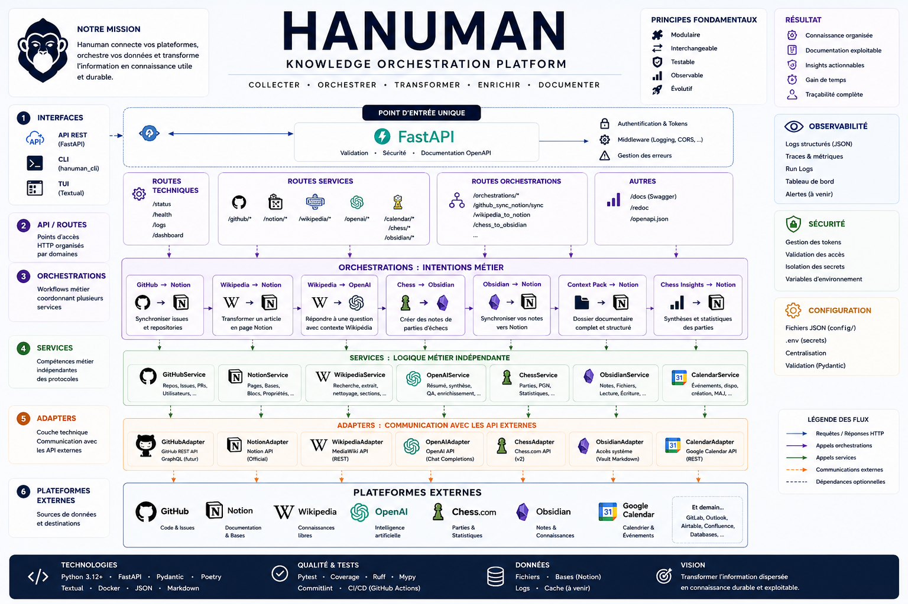

# 🐒 Hanuman


<p align="center">
  
</p>

> *Celui qui relie les mondes.*


---

# Présentation

Hanuman est un moteur d'orchestration intelligent développé en Python dont l'objectif est de centraliser, synchroniser et enrichir les informations provenant de multiples services numériques.

Le projet repose sur une idée simple :

> Les données ne doivent pas être enfermées dans des applications.

GitHub, Notion, Obsidian, Wikipedia, Google Calendar ou encore OpenAI sont d'excellents outils, mais chacun ne voit qu'une partie de notre activité.

Hanuman devient la couche d'intelligence située entre ces plateformes.

Il collecte les données.

Il les transforme.

Il les relie.

Puis il les redistribue vers les bons services.

Le résultat est un véritable système nerveux numérique.

---

# Philosophie

Contrairement à un simple wrapper d'API, Hanuman n'est pas conçu autour des plateformes.

Il est conçu autour des flux d'information.

Une information possède un cycle de vie.

Elle apparaît.

Elle est enrichie.

Elle est reliée à d'autres connaissances.

Puis elle est diffusée.

Chaque plateforme n'est qu'un moyen de stockage ou de visualisation.

La logique métier appartient entièrement à Hanuman.

---

# Pourquoi Hanuman ?

Aujourd'hui une même information est souvent dupliquée.

Une tâche GitHub est copiée dans Notion.

Une réunion est copiée dans Google Calendar.

Une documentation est recopiée dans Obsidian.

Un article Wikipedia est résumé dans ChatGPT.

Toutes ces opérations sont réalisées manuellement.

Hanuman automatise ces échanges.

Il devient le centre de communication de tout l'écosystème.

---

# Le nom

Dans la mythologie hindoue, Hanuman est le dieu-singe.

Il est le messager.

Le bâtisseur de ponts.

Celui qui relie deux mondes.

Cette symbolique représente parfaitement la philosophie du projet.

Hanuman ne remplace aucune plateforme.

Il construit des ponts entre elles.

---

# Vision

L'objectif final n'est pas de créer une simple API.

L'objectif est de construire un véritable système cognitif personnel.

Toutes les informations convergent vers un même moteur.

Les logiciels deviennent alors des interfaces spécialisées.

GitHub développe.

Notion organise.

Obsidian mémorise.

Calendar planifie.

OpenAI raisonne.

Wikipedia documente.

Hanuman orchestre.

---

# Architecture générale

```
                   Utilisateur

                        │

                        ▼

                  Vince (CLI / TUI)

                        │

                        ▼

                 Hanuman (FastAPI)

                        │

      ┌─────────────────┼─────────────────┐

      ▼                 ▼                 ▼

  GitHub API        Notion API      OpenAI API

      ▼                 ▼                 ▼

 Obsidian API      Wikipedia API   Google Calendar

                        │

                        ▼

                 Base de connaissances
```

---

# État du projet

Après restauration complète de l'environnement Linux Mint, le projet est entièrement opérationnel.

État actuel :

- API FastAPI fonctionnelle
- Swagger complet
- Architecture modulaire
- 146 tests automatisés
- Couverture d'environ 92 %
- Ruff
- mypy
- Poetry
- TUI Textual
- GitHub intégré
- Notion intégré
- OpenAI intégré
- Wikipedia intégrée
- Chess.com intégré
- Google Calendar intégré

Le projet est aujourd'hui dans une phase de consolidation.

La priorité n'est plus de faire fonctionner Hanuman.

La priorité est d'en faire une plateforme robuste et extensible.

---

# Fonctionnalités

## API REST

Hanuman expose une API REST développée avec FastAPI.

Cette API constitue le point d'entrée principal du projet.

Elle permet d'accéder aux différents services, de lancer des orchestrations et d'interagir avec les plateformes connectées.

---

## Documentation Swagger

Deux points d'entrée existent actuellement.

Le plus complet est :

```bash
poetry run uvicorn hanuman.main:app --reload
```

Accessible ensuite sur :

```
http://127.0.0.1:8000/docs
```

Ce point d'entrée expose l'ensemble des routes du projet.

Une version plus légère existe également :

```bash
hanuman.api.core.main
```

Elle ne charge qu'une partie des routeurs.

---

# Technologies

- Python 3.13
- FastAPI
- Poetry
- Pydantic
- HTTPX
- Rich
- Textual
- Pytest
- Ruff
- mypy
- Uvicorn

---

# Structure du projet

```
hanuman/

├── api/
├── config/
├── core/
├── models/
├── orchestrations/
├── services/
├── tui/
├── utils/
├── tests/
└── docs/
```

Chaque dossier possède une responsabilité unique.

Cette séparation constitue l'un des principes fondamentaux du projet.

---

# API

Le dossier API contient les interfaces HTTP exposées vers l'extérieur.

Il ne contient quasiment aucune logique métier.

Son rôle est simplement de :

- recevoir les requêtes
- valider les données
- appeler les services
- retourner une réponse

L'API reste volontairement légère.

Toute la logique est déléguée aux couches internes.

---

# Core

Le dossier Core représente le cœur du projet.

Il contient les composants partagés par l'ensemble de Hanuman.

On y retrouve notamment :

- configuration
- dépendances
- initialisation
- composants communs

Le Core ne dépend d'aucun service externe.

Il constitue les fondations du projet.

---

# Models

Les modèles représentent les objets manipulés par Hanuman.

Ils permettent de partager des structures communes entre les services.

Ils évitent les duplications de schémas.

Ils servent également de contrat entre les différentes couches.

---

# Services

Les services représentent les briques métiers.

Chaque plateforme possède généralement son propre service.

Par exemple :

- github_service
- notion_service
- openai_service
- wikipedia_service
- calendar_service
- chess_service

Un service ne connaît que son domaine.

Il ne réalise aucune orchestration complexe.

---

# Adapters

Les adapters constituent les interfaces avec les API externes.

Ils encapsulent complètement les appels HTTP.

Ainsi le reste du projet ignore totalement la manière dont GitHub ou Notion fonctionnent.

Cette abstraction facilite énormément les tests.

---

# Orchestrations

Les orchestrations représentent le véritable cœur de Hanuman.

Elles coordonnent plusieurs services afin de réaliser une tâche complexe.

Par exemple :

GitHub

↓

lecture des issues

↓

analyse

↓

transformation

↓

création de pages Notion

↓

journalisation

↓

réponse API

Les orchestrations sont indépendantes des plateformes.

Elles manipulent uniquement les services.

---

# TUI

Hanuman possède également une interface terminal développée avec Textual.

Cette interface permet d'interagir avec le projet sans passer par Swagger.

Le TUI constitue la base du futur assistant personnel en ligne de commande.

---

# Intégrations

## GitHub

Lecture des dépôts.

Lecture des issues.

Synchronisation.

Statistiques.

Gestion des projets.

---

## Notion

Création de pages.

Mise à jour.

Recherche.

Synchronisation.

---

## OpenAI

Résumé.

Classification.

Analyse.

Enrichissement.

Réponses automatiques.

---

## Wikipedia

Recherche.

Extraction.

Création de context packs.

Documentation.

---

## Chess.com

Lecture des parties.

Analyse.

Export.

Synchronisation avec Obsidian.

---

## Google Calendar

Lecture des événements.

Création.

Synchronisation.

Organisation.

---

## Obsidian

Création de notes.

Archivage.

Synchronisation.

Documentation.

---

# Tests

Le projet dispose actuellement de :

- 146 tests

Les tests couvrent notamment :

- API
- Services
- Orchestrations
- Middleware
- Utils
- TUI
- Adaptateurs
- Intégrations

La couverture est proche de 92 %.

---

# Qualité

Hanuman suit une politique stricte de qualité.

Avant chaque commit :

- Ruff
- mypy
- pytest

doivent être exécutés.

Cette discipline permet de conserver une base de code stable.

---

# Installation

```bash
git clone ...

cd hanuman

poetry install
```

Créer ensuite un fichier `.env`.

Puis :

```bash
poetry run uvicorn hanuman.main:app --reload
```

Swagger est alors disponible sur :

```
http://127.0.0.1:8000/docs
```

---

# Variables d'environnement

Le projet utilise notamment :

```
OPENAI_API_KEY

NOTION_TOKEN

GITHUB_TOKEN

GOOGLE_CLIENT_ID

GOOGLE_CLIENT_SECRET

GOOGLE_REDIRECT_URI
```

Les secrets ne doivent jamais être versionnés.

---

# Objectifs

Les prochaines étapes du projet sont :

- renforcer les orchestrations
- ajouter de nouveaux connecteurs
- développer les agents spécialisés
- enrichir la mémoire
- améliorer le TUI
- ajouter davantage d'automatisations
- documenter l'ensemble de l'architecture

---

# Vision à long terme

Hanuman n'est pas simplement un projet Python.

Il représente la tentative de construire un système capable de relier l'ensemble des connaissances numériques d'une personne.

L'objectif est qu'un jour chaque note, chaque tâche, chaque dépôt GitHub, chaque document et chaque événement de calendrier puissent être considérés comme les différentes représentations d'une même connaissance.

Hanuman ne remplace pas les outils existants.

Il leur donne un langage commun.

En devenant le point central des échanges, il transforme un ensemble d'applications indépendantes en un véritable écosystème cohérent.

C'est cette ambition qui guide l'ensemble du développement du projet.

---

# Architecture interne

## Une architecture orientée orchestration

Contrairement à la plupart des applications FastAPI, Hanuman n'a pas été pensé comme une simple API REST.

L'API n'est qu'une porte d'entrée.

La véritable logique du projet se situe dans les couches internes.

L'architecture suit une séparation stricte des responsabilités.

```
                    Client

                      │

             HTTP / CLI / TUI

                      │

                  FastAPI

                      │

                  Routers

                      │

                  Services

                      │

              Orchestrations

          ┌─────────┼─────────┐

          ▼         ▼         ▼

      GitHub     Notion    Wikipedia

          ▼         ▼         ▼

      OpenAI   Calendar   Obsidian

```

Chaque couche possède un rôle précis.

Une couche ne doit jamais empiéter sur la responsabilité d'une autre.

---

# Principe fondamental

Hanuman suit une règle extrêmement importante.

> Une couche ne connaît jamais l'implémentation de la couche située en dessous.

Par exemple :

Le routeur FastAPI ignore totalement comment GitHub fonctionne.

Il appelle simplement un service.

Le service ignore totalement comment GitHub communique.

Il appelle simplement un adapter.

L'adapter est le seul composant autorisé à dialoguer directement avec l'API GitHub.

Cette séparation rend le projet extrêmement robuste.

---

# Découpage général

```
hanuman/

api/
config/
core/
models/
services/
orchestrations/
utils/
tui/
tests/
```

Chaque dossier possède une mission unique.

---

# api/

Le dossier `api` représente la couche de présentation.

Il ne contient aucune logique métier importante.

Il reçoit les requêtes.

Il valide les paramètres.

Il appelle les services.

Il construit les réponses HTTP.

Cette couche doit rester la plus simple possible.

Elle ne doit jamais contenir de traitement complexe.

---

## api/core

Ce dossier contient la construction de l'application FastAPI.

On y retrouve notamment :

- création de l'application
- middleware
- configuration
- injection des routeurs
- gestion des exceptions
- démarrage

C'est ici que l'application prend vie.

Lors de l'audit réalisé en 2026, deux points d'entrée ont été identifiés.

Le premier :

```python
hanuman.api.core.main
```

charge une version relativement légère de l'application.

Le second :

```python
hanuman.main
```

constitue aujourd'hui le véritable point d'entrée principal.

C'est celui qui expose l'ensemble des routeurs dans Swagger.

---

## api/routers

Les routeurs représentent les différentes familles d'endpoints.

Par exemple :

```
/github
/notion
/orchestrations
/dashboard
/chess
```

Chaque routeur est indépendant.

Il possède uniquement la responsabilité de recevoir une requête HTTP.

Il ne contient aucune logique métier.

Cette logique est immédiatement déléguée aux services.

---

# config/

Le dossier `config` centralise l'ensemble de la configuration du projet.

Il permet notamment :

- lecture des variables d'environnement
- chargement du fichier `.env`
- constantes
- configuration globale

Grâce à cette séparation, aucun composant métier n'a besoin de connaître directement les secrets de l'application.

---

# core/

Le dossier `core` constitue le cœur technique de Hanuman.

Il contient les composants réutilisables par l'ensemble du projet.

On y trouve notamment :

- objets partagés
- configuration interne
- composants génériques
- outils communs

Le Core ne dépend normalement d'aucune API externe.

Il représente les fondations du système.

---

# models/

Les modèles représentent les objets manipulés par Hanuman.

Ils permettent de partager des structures cohérentes entre toutes les couches.

Par exemple :

Une Issue GitHub.

Une Page Notion.

Un Événement Calendar.

Une Partie Chess.com.

Chaque modèle constitue un contrat.

Tous les services manipulent les mêmes objets.

Cela évite la duplication du code.

---

# services/

Les services représentent les briques métiers.

Chaque service correspond généralement à une plateforme.

Par exemple :

```
github_service

notion_service

openai_service

calendar_service

wikipedia_service

obsidian_service

chess_service
```

Un service possède une responsabilité unique.

Par exemple :

Le GitHubService sait :

- récupérer des dépôts
- récupérer des issues
- récupérer des pull requests

Mais il ne sait absolument pas créer une page Notion.

Ce n'est pas son rôle.

---

# Les services sont indépendants

L'un des objectifs principaux de Hanuman est que chaque service puisse fonctionner seul.

Le service GitHub peut être utilisé sans Notion.

Le service Notion peut être utilisé sans OpenAI.

Le service Calendar peut fonctionner sans Obsidian.

Les dépendances sont réduites au minimum.

Cette architecture facilite énormément les tests.

---

# adapters/

Les adapters représentent la frontière entre Hanuman et le monde extérieur.

Ils encapsulent totalement les API.

Par exemple :

GitHubAdapter

↓

effectue les appels HTTP

↓

analyse les réponses

↓

gère les erreurs

↓

retourne des objets Python

Ainsi le reste du projet ignore complètement les détails de GitHub.

Si demain GitHub modifie son API, seul l'adapter devra être modifié.

Le reste du projet continuera de fonctionner.

---

# Pourquoi utiliser des adapters ?

Cette couche apporte plusieurs avantages.

## Isolation

Le code métier ne dépend jamais d'une API externe.

---

## Testabilité

Les adapters peuvent être simulés très facilement.

Les services peuvent être testés sans connexion Internet.

---

## Maintenance

Changer une API externe ne nécessite pas de réécrire l'ensemble du projet.

---

## Réutilisation

Plusieurs services peuvent partager le même adapter.

---

# Flux de données

Le chemin suivi par une requête est toujours le même.

```
HTTP Request

↓

Router

↓

Service

↓

Adapter

↓

API distante

↓

Adapter

↓

Service

↓

Router

↓

HTTP Response
```

Cette architecture est volontairement répétitive.

Elle garantit une excellente lisibilité du code.

---
 
# Les orchestrations

## Le véritable cœur de Hanuman

Les orchestrations constituent la partie la plus importante du projet.

Si les services représentent les organes de Hanuman, les orchestrations représentent son intelligence.

Un service sait accomplir une action.

Une orchestration sait pourquoi, quand et comment plusieurs actions doivent être combinées.

Autrement dit :

Un service est spécialisé.

Une orchestration est stratégique.

C'est cette différence qui fait de Hanuman un moteur d'orchestration plutôt qu'une simple bibliothèque Python.

---

# Qu'est-ce qu'une orchestration ?

Une orchestration est un scénario métier.

Elle combine plusieurs services afin de réaliser une tâche complexe.

Par exemple :

```
GitHub

↓

Lecture des issues

↓

Analyse

↓

Transformation

↓

Création des pages Notion

↓

Journalisation

↓

Réponse API
```

Aucun service ne possède cette vision globale.

Seule l'orchestration la possède.

---

# Pourquoi séparer les orchestrations ?

Prenons un exemple simple.

Le GitHubService sait récupérer une issue.

Le NotionService sait créer une page.

Mais lequel des deux sait :

- comparer les données ?
- détecter une mise à jour ?
- ignorer les doublons ?
- gérer les erreurs ?
- reprendre une synchronisation interrompue ?

Aucun.

Cette responsabilité appartient exclusivement à l'orchestration.

---

# Philosophie

Une orchestration ne connaît jamais les API.

Elle ne réalise aucun appel HTTP.

Elle ne construit jamais une requête.

Elle ne parse jamais du JSON.

Elle ne fait que coordonner les services.

Cette règle est fondamentale.

---

# Cycle de vie d'une orchestration

Toutes les orchestrations suivent le même schéma.

```
Entrée

↓

Validation

↓

Lecture des données

↓

Transformation

↓

Enrichissement

↓

Synchronisation

↓

Journalisation

↓

Réponse
```

Cette homogénéité facilite énormément la maintenance.

---

# Exemple : GitHub → Notion

L'une des orchestrations historiques du projet est la synchronisation GitHub vers Notion.

Son objectif est de transformer automatiquement les issues GitHub en pages Notion.

Le déroulement est le suivant.

```
Utilisateur

↓

API

↓

GitHubService

↓

Liste des issues

↓

Transformation

↓

NotionService

↓

Création des pages

↓

Rapport

↓

Réponse HTTP
```

L'utilisateur n'a plus besoin de recopier les tâches.

Hanuman s'en charge automatiquement.

---

# Exemple : Wikipedia → Notion

Cette orchestration permet de transformer un article Wikipedia en documentation exploitable.

Le flux est le suivant.

```
Wikipedia

↓

Extraction

↓

Nettoyage

↓

Structuration

↓

Création Notion

↓

Retour utilisateur
```

Cette approche permet de constituer très rapidement une base documentaire.

---

# Exemple : Wikipedia Context Pack

Le Context Pack est une évolution de l'orchestration précédente.

L'objectif n'est plus simplement de copier un article.

Il s'agit de produire un véritable dossier documentaire.

Une requête utilisateur devient :

- article principal
- articles liés
- résumé
- liens internes
- informations contextuelles

Le résultat est bien plus riche qu'une simple copie.

---

# Exemple : Wikipedia + OpenAI

Cette orchestration combine deux services.

Wikipedia fournit la matière première.

OpenAI fournit l'analyse.

Le résultat devient :

```
Wikipedia

↓

Extraction

↓

OpenAI

↓

Résumé

↓

Analyse

↓

Structuration

↓

Notion
```

On ne transporte plus uniquement de l'information.

On transporte de la connaissance enrichie.

---

# Exemple : Chess.com → Obsidian

Cette orchestration récupère automatiquement des parties d'échecs.

Les données peuvent ensuite être archivées dans Obsidian.

Le processus est le suivant.

```
Chess.com

↓

Téléchargement

↓

Analyse

↓

Création Markdown

↓

Obsidian
```

L'ensemble de l'historique devient consultable localement.

---

# Exemple : Chess Insights

Cette orchestration va plus loin.

Elle ne stocke pas simplement une partie.

Elle produit des statistiques.

Par exemple :

- ouverture favorite
- précision moyenne
- évolution Elo
- fréquence des erreurs
- adversaires rencontrés

Ces informations peuvent ensuite être utilisées par d'autres services.

---

# Journalisation

Toutes les orchestrations produisent un rapport d'exécution.

Celui-ci contient généralement :

- date
- durée
- paramètres
- erreurs
- éléments créés
- éléments ignorés
- résumé final

Cette journalisation facilite énormément le débogage.

---

# Gestion des erreurs

Une orchestration ne doit jamais interrompre l'ensemble d'un traitement à cause d'une seule erreur.

Exemple :

100 issues GitHub.

La 57ème échoue.

Le traitement continue.

Le rapport final indique simplement :

```
99 réussies

1 échouée
```

Cette philosophie améliore énormément la robustesse.

---

# Idempotence

Une bonne orchestration doit pouvoir être relancée plusieurs fois.

Si les données existent déjà :

- elles sont mises à jour

ou

- elles sont ignorées

mais jamais dupliquées.

Cette propriété est essentielle pour les synchronisations.

---

# Les orchestrations sont indépendantes

Chaque orchestration constitue un module autonome.

Elle peut être appelée :

- depuis FastAPI
- depuis le TUI
- depuis un script Python
- depuis une tâche planifiée
- depuis un futur agent IA

Cette indépendance facilite énormément leur réutilisation.

---

# Le futur des orchestrations

Aujourd'hui, les orchestrations sont principalement linéaires.

```
A

↓

B

↓

C
```

À terme, Hanuman évoluera vers un moteur d'orchestration dynamique.

Les scénarios deviendront de véritables graphes.

```
          GitHub

             │

      ┌──────┴──────┐

      ▼             ▼

  Notion        Calendar

      │             │

      └──────┬──────┘

             ▼

          OpenAI

             │

             ▼

        Rapport final
```

Chaque nœud représentera une action.

Chaque arête représentera un flux de données.

Hanuman ne sera plus une succession de scripts.

Il deviendra un moteur d'exécution capable de construire et d'exécuter automatiquement des pipelines complexes.

C'est cette évolution qui constitue le cœur de la vision Hanuman v2.

---

# Les services

## Les briques métiers de Hanuman

Les services constituent la couche métier du projet.

Chaque service représente un domaine fonctionnel précis.

Contrairement aux orchestrations, un service ne coordonne pas plusieurs plateformes.

Il est spécialisé dans une seule responsabilité.

Cette approche suit le principe du **Single Responsibility Principle (SRP)**.

Autrement dit :

> Un service doit avoir une seule raison de changer.

---

# Organisation générale

Les services sont regroupés dans le dossier :

```
services/
```

Chaque plateforme importante possède son propre service.

Par exemple :

```
github_service.py

notion_service.py

wikipedia_service.py

calendar_service.py

openai_service.py

obsidian_service.py

chess_service.py
```

Cette organisation permet de conserver un code clair et facilement extensible.

---

# Pourquoi utiliser des services ?

Sans cette couche, les routeurs FastAPI devraient directement communiquer avec les API externes.

On obtiendrait rapidement un code difficile à maintenir.

Exemple d'un mauvais fonctionnement :

```
FastAPI

↓

GitHub HTTP

↓

Notion HTTP

↓

OpenAI HTTP

↓

Retour utilisateur
```

Toute la logique serait mélangée.

Au contraire, Hanuman adopte une architecture propre :

```
FastAPI

↓

Service

↓

Adapter

↓

API distante
```

Chaque couche possède une responsabilité bien définie.

---

# Les responsabilités d'un service

Un service peut :

- récupérer des données
- transformer des objets
- effectuer des validations
- appeler plusieurs adapters d'une même plateforme
- gérer des exceptions métiers
- exposer une API Python cohérente

En revanche, il ne doit jamais :

- construire une réponse HTTP
- afficher une interface utilisateur
- manipuler directement FastAPI
- lancer une orchestration complète

---

# Exemple : GitHubService

Le GitHubService centralise toutes les opérations liées à GitHub.

Par exemple :

- récupérer les dépôts
- récupérer les issues
- récupérer les pull requests
- récupérer les labels
- récupérer les milestones
- récupérer les commentaires

Toutes ces opérations sont regroupées au même endroit.

Le reste du projet ne connaît jamais directement l'API GitHub.

---

# Exemple : NotionService

Le NotionService représente l'ensemble des interactions avec Notion.

Il est responsable notamment de :

- créer une page
- modifier une page
- supprimer une page
- rechercher une base de données
- rechercher une page
- mettre à jour les propriétés

Les orchestrations utilisent uniquement cette interface.

---

# Exemple : WikipediaService

Ce service permet notamment :

- rechercher un article
- récupérer un résumé
- récupérer le contenu complet
- récupérer les catégories
- récupérer les liens internes

Toutes ces opérations sont isolées dans un seul composant.

---

# Exemple : OpenAIService

Le service OpenAI représente la couche d'intelligence artificielle du projet.

Il est notamment responsable de :

- générer un résumé
- répondre à une question
- reformuler un texte
- analyser un contenu
- produire une synthèse

Ainsi, si demain OpenAI change complètement son API, le reste du projet restera inchangé.

---

# Exemple : CalendarService

Le CalendarService centralise toutes les opérations liées à Google Calendar.

Par exemple :

- créer un événement
- lire un calendrier
- modifier un rendez-vous
- supprimer un événement
- rechercher une plage horaire

Les orchestrations peuvent ainsi manipuler des événements sans connaître Google Calendar.

---

# Exemple : ChessService

Ce service constitue l'interface avec Chess.com.

Il permet notamment :

- télécharger les parties
- récupérer les statistiques
- récupérer les profils
- analyser l'historique

Ces données pourront ensuite être utilisées par d'autres orchestrations.

---

# Exemple : ObsidianService

L'objectif de ce service est de manipuler un coffre Obsidian comme une véritable base documentaire.

Il permet par exemple :

- créer une note
- modifier une note
- rechercher une note
- exporter du Markdown
- organiser les dossiers

À terme, Obsidian deviendra probablement la mémoire locale de Hanuman.

---

# Communication entre services

En règle générale, les services ne doivent pas dépendre les uns des autres.

Cette règle est importante.

Par exemple :

Le GitHubService ne devrait jamais appeler directement le NotionService.

Si une synchronisation GitHub → Notion est nécessaire,

c'est une orchestration qui devra appeler les deux services.

Cette séparation rend le projet beaucoup plus modulaire.

---

# Les services sont testables

L'un des principaux avantages de cette architecture est la facilité des tests.

Chaque service peut être testé indépendamment.

Par exemple :

```
Test GitHubService

↓

Mock GitHub API

↓

Vérification des objets retournés
```

Il n'est pas nécessaire de démarrer toute l'application.

Cette approche explique la très bonne couverture actuelle du projet.

---

# Les services comme API interne

On peut considérer les services comme une seconde API.

L'API HTTP est destinée aux utilisateurs.

Les services sont destinés aux développeurs.

Ils offrent une interface Python propre, stable et documentée.

Cette distinction facilite énormément l'évolution du projet.

---

# Vers une architecture de plugins

L'architecture actuelle permet déjà d'imaginer une évolution importante.

À terme, chaque service pourrait devenir un plugin indépendant.

Par exemple :

```
hanuman-github

hanuman-notion

hanuman-openai

hanuman-calendar

hanuman-wikipedia

hanuman-chess
```

Le cœur de Hanuman chargerait uniquement les services nécessaires.

Cette approche rendrait le projet extrêmement modulaire et permettrait à la communauté de développer ses propres connecteurs sans modifier le cœur du système.

Cette vision s'inscrit pleinement dans l'objectif de faire de Hanuman non seulement une application, mais une véritable plateforme d'orchestration extensible.

---

# Les adaptateurs (Adapters)

## La frontière entre Hanuman et le monde extérieur

Les adaptateurs représentent la couche la plus proche des API externes.

Ils sont volontairement isolés afin que le reste de Hanuman ne dépende jamais directement d'un fournisseur.

Cette couche joue un rôle essentiel.

Elle protège le cœur du projet contre les changements des API.

Autrement dit :

```
GitHub change son API

↓

Modification du GitHub Adapter

↓

Le reste de Hanuman continue de fonctionner
```

Aucun autre composant n'a besoin d'être modifié.

---

# Pourquoi cette couche ?

Sans adaptateur, chaque service devrait connaître :

- les URLs
- les endpoints
- l'authentification
- le format JSON
- les erreurs HTTP
- les codes de retour

Le projet deviendrait très rapidement difficile à maintenir.

Les adaptateurs encapsulent toute cette complexité.

---
# Développement

## Philosophie du développement

Hanuman n'est pas développé comme un simple projet personnel.

Depuis ses premières versions, il est conçu comme un logiciel pouvant évoluer pendant plusieurs années.

Chaque nouvelle fonctionnalité doit respecter les principes suivants :

- lisibilité
- modularité
- testabilité
- extensibilité
- documentation

Le projet privilégie toujours une architecture claire à une implémentation rapide.

---

# Gestion des dépendances

Hanuman utilise **Poetry** comme gestionnaire de dépendances.

Poetry présente plusieurs avantages :

- environnement virtuel intégré
- résolution fiable des dépendances
- verrouillage des versions
- reproductibilité des installations

Installation :

```bash
poetry install
```

Activation :

```bash
poetry shell
```

Ou directement :

```bash
poetry run python ...
```

---

# Démarrage de l'API

Le point d'entrée principal est :

```bash
poetry run uvicorn hanuman.main:app --reload
```

Cette commande lance :

- FastAPI
- Swagger
- Rechargement automatique
- L'ensemble des routeurs

Documentation :

```
http://127.0.0.1:8000/docs
```

---

# Environnement de développement

Le projet est principalement développé sous Linux.

Cependant, il reste compatible avec :

- Linux
- Windows
- macOS

Le développement est réalisé à l'aide de :

- VS Code
- Poetry
- Git
- Ruff
- mypy
- Pytest

---

# Style de code

Hanuman suit les conventions officielles de Python.

Les objectifs sont :

- simplicité
- lisibilité
- cohérence

Le code privilégie toujours :

- des fonctions courtes
- des classes spécialisées
- des responsabilités uniques
- des noms explicites

Les commentaires sont utilisés uniquement lorsque le code ne peut pas s'expliquer lui-même.

---

# Analyse statique

Avant chaque commit, plusieurs outils vérifient automatiquement la qualité du projet.

## Ruff

Ruff vérifie :

- style
- erreurs fréquentes
- imports
- simplifications
- bonnes pratiques

Exécution :

```bash
ruff check .
```

---

## mypy

Mypy effectue une analyse statique du typage.

Il détecte notamment :

- incompatibilités de types
- valeurs nulles
- erreurs de signatures
- oublis de retour

Commande :

```bash
mypy .
```

Le projet est aujourd'hui entièrement compatible avec mypy.

---

# Tests

Les tests sont réalisés avec Pytest.

Ils couvrent actuellement :

- API
- services
- orchestrations
- adaptateurs
- middleware
- utilitaires
- interface TUI

Exécution :

```bash
pytest
```

---

# Couverture

La couverture actuelle est proche de :

```
92 %
```

Cela représente environ :

```
146 tests
```

Cette couverture garantit une excellente stabilité du projet.

---

# Philosophie des tests

Chaque fonctionnalité importante doit posséder son propre test.

Les tests doivent être :

- indépendants
- reproductibles
- rapides
- lisibles

Les appels vers les plateformes externes sont simulés autant que possible.

Ainsi, les tests restent entièrement exécutables hors connexion.

---

# Organisation des tests

Les tests reproduisent généralement l'arborescence du projet.

Exemple :

```
services/

↓

tests/services/

api/

↓

tests/api/

orchestrations/

↓

tests/orchestrations/
```

Cette organisation facilite énormément la maintenance.

---

# Documentation automatique

FastAPI génère automatiquement la documentation Swagger.

Cette documentation constitue la référence officielle des endpoints HTTP.

Elle permet :

- tester les routes
- visualiser les paramètres
- consulter les modèles
- comprendre les réponses

Aucune documentation supplémentaire n'est nécessaire pour l'API.

---

# Gestion des secrets

Aucun secret ne doit être présent dans le code source.

Les clés API sont stockées dans :

```
.env
```

Le dépôt ne contient jamais :

- tokens GitHub
- clés OpenAI
- tokens Notion
- secrets Google

Cette séparation permet de publier librement le code.

---

# Git

Le développement suit une approche classique.

Avant chaque modification importante :

```bash
git pull
```

Après modification :

```bash
git status
```

Puis :

```bash
git add .

git commit

git push
```

L'objectif est de conserver un historique propre et compréhensible.

---

# Débogage

La majorité du débogage est réalisée grâce à :

- Swagger
- logs
- Pytest
- Ruff
- mypy

Cette combinaison permet généralement d'identifier rapidement l'origine d'un problème.

---

# Documentation du code

Chaque composant important est destiné à être documenté.

Les docstrings doivent expliquer :

- le rôle du composant
- les paramètres
- les valeurs retournées
- les exceptions éventuelles

L'objectif est que le code puisse être compris plusieurs années après son écriture.

---

# Performances

Hanuman n'a pas été conçu pour exécuter des millions de requêtes par seconde.

Son objectif est différent.

Il privilégie :

- la fiabilité
- la robustesse
- la clarté
- la maintenabilité

Les performances restent néanmoins une préoccupation constante.

Les traitements coûteux sont progressivement déplacés vers des tâches asynchrones lorsque cela est pertinent.

---

# Compatibilité

L'architecture actuelle permet déjà d'intégrer facilement de nouvelles plateformes.

Pour ajouter un nouveau connecteur, il suffit généralement de créer :

```
Adapter

↓

Service

↓

Orchestration

↓

Router (optionnel)
```

Cette régularité réduit considérablement le coût de développement.

---

# Évolution continue

Hanuman est un projet vivant.

Son architecture a déjà évolué à plusieurs reprises et continuera d'évoluer.

Toutefois, certains principes resteront inchangés :

- séparation stricte des responsabilités
- découplage des plateformes
- forte couverture de tests
- qualité du code
- documentation complète

Ces principes constituent le socle sur lequel reposera l'ensemble des futures versions du projet.

---

# Responsabilités d'un adapter

Un adapter est responsable de :

- construire une requête HTTP
- envoyer cette requête
- gérer l'authentification
- gérer les erreurs réseau
- parser la réponse
- convertir le JSON en objets Python
- lever des exceptions compréhensibles

En revanche, il ne doit jamais :

- prendre une décision métier
- créer une orchestration
- construire une réponse FastAPI
- dialoguer avec plusieurs plateformes

---

# Exemple : GitHubAdapter

Le GitHubAdapter connaît parfaitement l'API GitHub.

Il sait notamment :

- créer une session HTTP
- envoyer le token GitHub
- appeler les endpoints REST
- gérer la pagination
- convertir les réponses JSON

Pour le reste du projet, GitHub devient simplement :

```python
issues = github_adapter.get_issues(repository)
```

Le service ignore totalement la manière dont cette méthode fonctionne.

---

# Exemple : NotionAdapter

Le NotionAdapter encapsule entièrement l'API Notion.

Il est responsable de :

- l'authentification
- la construction des payloads
- la création des pages
- la mise à jour des propriétés
- la lecture des bases de données

Le NotionService ne voit jamais une requête HTTP.

---

# Les bénéfices

## Isolation

Les API changent régulièrement.

Grâce aux adaptateurs, ces changements restent confinés dans une seule partie du projet.

---

## Testabilité

Les adaptateurs peuvent être remplacés par des mocks.

Les tests deviennent très rapides.

Aucune connexion Internet n'est nécessaire.

---

## Lisibilité

Le code métier reste extrêmement simple.

On lit :

```python
github_service.get_issues()
```

et non :

```python
requests.get(
    "...",
    headers=...
)
```

---

## Réutilisation

Plusieurs services peuvent utiliser le même adaptateur.

L'authentification n'est implémentée qu'une seule fois.

---

# Les modèles (Models)

## Un langage commun

Hanuman manipule des dizaines de plateformes.

GitHub possède son format.

Notion possède son format.

Wikipedia possède son format.

OpenAI possède son format.

Si chaque service utilisait directement ces structures, le projet deviendrait extrêmement complexe.

Les modèles servent à créer un langage commun.

---

# Exemple

Une issue GitHub peut contenir :

- un titre
- un auteur
- des labels
- un état
- une description

Une page Notion contient :

- un titre
- un contenu
- des propriétés

Les deux objets sont différents.

Pourtant Hanuman peut les représenter à l'aide d'objets internes.

Les orchestrations manipulent donc des modèles Python plutôt que du JSON.

---

# Pourquoi utiliser des modèles ?

Les modèles apportent plusieurs avantages.

## Validation

Les données sont vérifiées dès leur création.

---

## Documentation

Chaque objet possède une structure claire.

---

## Typage

Les IDE comprennent parfaitement les données.

Les erreurs sont détectées avant l'exécution.

---

## Réutilisation

Le même modèle peut être utilisé dans plusieurs services.

---

# Les utilitaires (Utils)

Les utilitaires regroupent toutes les fonctions génériques du projet.

Ils ne sont liés à aucune plateforme particulière.

On y retrouve généralement :

- manipulation de dates
- journalisation
- conversions
- helpers
- fonctions communes
- formatage

Ces composants sont volontairement indépendants.

Ils peuvent être utilisés partout dans Hanuman.

---

# La configuration

Toute la configuration du projet est centralisée.

L'objectif est double.

Premièrement :

éviter les constantes dispersées dans le code.

Deuxièmement :

séparer totalement le code des secrets.

---

# Variables d'environnement

Hanuman utilise un fichier `.env`.

Les principales variables sont notamment :

```
OPENAI_API_KEY

NOTION_TOKEN

GITHUB_TOKEN

GOOGLE_CLIENT_ID

GOOGLE_CLIENT_SECRET

GOOGLE_REDIRECT_URI
```

Aucun secret ne doit être présent dans le dépôt Git.

Le fichier `.env` est volontairement ignoré par Git grâce au `.gitignore`.

---

# Gestion des erreurs

Hanuman distingue plusieurs familles d'erreurs.

## Erreurs réseau

Connexion impossible.

Timeout.

API indisponible.

---

## Erreurs d'authentification

Token invalide.

Permission insuffisante.

Utilisateur inconnu.

---

## Erreurs métier

Synchronisation impossible.

Objet introuvable.

Conflit de données.

---

## Erreurs internes

Exception Python.

Bug.

État incohérent.

---

Toutes ces erreurs sont capturées puis remontées sous une forme compréhensible.

Le but est d'éviter les longues traces Python inutiles pour l'utilisateur.

---

# Journalisation

Chaque action importante est enregistrée.

Les journaux permettent notamment de connaître :

- la date
- l'heure
- la durée
- le service utilisé
- les paramètres
- les erreurs rencontrées
- le résultat obtenu

Cette journalisation est particulièrement utile lors des orchestrations complexes.

---

# Performance

Hanuman est conçu pour minimiser les appels réseau.

Lorsqu'une plateforme retourne plusieurs centaines d'objets, les traitements sont réalisés localement autant que possible.

L'objectif est de réduire :

- le temps d'exécution
- la consommation des API
- les risques de limitation ("rate limiting")

À terme, un système de cache pourra être ajouté afin d'éviter les appels inutiles vers les plateformes externes.

---

# Une architecture pensée pour durer

L'ensemble de cette architecture repose sur une idée simple :

> Les plateformes changent. Les principes restent.

GitHub évoluera.

Notion évoluera.

OpenAI évoluera.

Wikipedia évoluera.

Mais tant que Hanuman conservera cette séparation stricte entre API, services, adaptateurs et orchestrations, le projet restera robuste, maintenable et extensible.

C'est cette philosophie qui fait aujourd'hui de Hanuman bien plus qu'une simple collection de scripts Python : un véritable moteur d'orchestration.

---

# Audit technique

## Introduction

Au fil de son développement, Hanuman est progressivement passé du statut de collection de scripts expérimentaux à celui d'une véritable plateforme d'orchestration.

L'audit réalisé en 2026 avait deux objectifs.

Le premier consistait à vérifier que l'ensemble du projet était encore fonctionnel après la reconstruction complète de l'environnement de développement.

Le second visait à identifier les forces de l'architecture ainsi que les améliorations nécessaires avant le développement de la prochaine génération de Hanuman.

Les conclusions sont très positives.

Le projet possède aujourd'hui une base particulièrement saine.

---

# État général

Après restauration complète de l'environnement de développement :

✓ Installation Poetry

✓ Variables d'environnement restaurées

✓ FastAPI fonctionnelle

✓ Swagger opérationnel

✓ Ruff sans erreur

✓ mypy valide

✓ 146 tests réussis

✓ Couverture proche de 92 %

Le projet est donc pleinement opérationnel.

---

# Points forts

## Architecture modulaire

L'un des principaux atouts de Hanuman est son architecture.

Le découpage en couches est particulièrement propre.

```
API

↓

Services

↓

Adapters

↓

Orchestrations

↓

Plateformes externes
```

Chaque couche possède une responsabilité clairement définie.

Cette organisation rend le projet agréable à maintenir.

---

# Très bonne couverture de tests

Avec près de 150 tests automatisés, Hanuman bénéficie déjà d'une couverture rarement rencontrée sur un projet personnel.

Les tests couvrent notamment :

- les services
- les orchestrations
- l'API
- les middlewares
- les utilitaires
- les adaptateurs
- le TUI

Cette base constitue un excellent filet de sécurité.

---

# Typage

Le projet utilise largement les annotations de types.

Le passage complet sous mypy améliore :

- la lisibilité
- l'autocomplétion
- la robustesse

Le nombre d'erreurs détectées avant l'exécution augmente considérablement.

---

# Ruff

L'utilisation de Ruff garantit une excellente homogénéité du code.

Le style reste cohérent dans l'ensemble du projet.

Les erreurs classiques sont détectées très tôt.

---

# Organisation des responsabilités

Le découpage entre :

- services
- orchestrations
- adaptateurs

est particulièrement pertinent.

Il limite fortement le couplage entre les composants.

---

# API

FastAPI apporte plusieurs avantages.

- documentation automatique

- validation des données

- modèles Pydantic

- Swagger

Le choix est particulièrement adapté au projet.

---

# Documentation Swagger

L'ensemble des endpoints est immédiatement testable.

Cela facilite énormément le développement.

La documentation devient une interface de travail.

---

# Points perfectibles

Aucun projet n'est parfait.

Hanuman possède encore plusieurs axes d'amélioration.

---

# Deux points d'entrée FastAPI

L'audit a mis en évidence deux applications FastAPI.

```
hanuman.api.core.main
```

et

```
hanuman.main
```

Le premier expose une version réduite.

Le second expose l'application complète.

Cette coexistence peut rapidement créer de la confusion.

À terme, il serait préférable de conserver un seul point d'entrée officiel.

---

# Configuration

Deux systèmes de configuration semblent coexister.

```
config/

core/config.py
```

Même si cette organisation fonctionne, une unification simplifierait la compréhension globale.

---

# Documentation

Le README historique ne reflète plus l'état réel du projet.

Il décrit une architecture plus ancienne.

Depuis, Hanuman a énormément évolué.

La présente documentation a précisément pour objectif de résoudre ce problème.

---

# Standardisation

Certaines parties du projet utilisent des conventions légèrement différentes.

Par exemple :

- noms de fichiers

- organisation des modules

- structure des services

Une harmonisation progressive améliorerait encore la lisibilité.

---

# Plugins

Aujourd'hui les services sont intégrés directement au projet.

À long terme, ils pourraient devenir des extensions indépendantes.

Exemple :

```
hanuman-github

hanuman-notion

hanuman-openai

hanuman-calendar

hanuman-wikipedia
```

Hanuman chargerait uniquement les modules installés.

Cette architecture ouvrirait la voie à un véritable écosystème.

---

# Pipeline d'orchestration

Les orchestrations sont actuellement essentiellement procédurales.

```
A

↓

B

↓

C
```

À terme, elles pourraient devenir des graphes orientés.

```
GitHub

├──► Notion

├──► Calendar

└──► OpenAI

        │

        ▼

 Rapport
```

Cette évolution permettrait :

- le parallélisme

- la reprise sur erreur

- la visualisation

- la planification

- le monitoring

---

# Base de données

Aujourd'hui, Hanuman s'appuie principalement sur les plateformes externes.

Une base de données locale pourrait progressivement devenir le cœur du système.

Elle permettrait notamment :

- le cache

- l'historique

- la mémoire

- la recherche

- les statistiques

Hanuman deviendrait alors réellement indépendant des plateformes.

---

# Gestion des tâches

Certaines orchestrations peuvent être longues.

À terme, un système de file d'attente serait intéressant.

Par exemple :

```
Utilisateur

↓

API

↓

Queue

↓

Worker

↓

Rapport
```

Cette architecture améliorerait énormément les performances.

---

# Observabilité

Hanuman possède déjà des logs.

Mais plusieurs améliorations restent possibles.

Par exemple :

- tableau de bord

- statistiques

- temps d'exécution

- nombre d'orchestrations

- historique

- erreurs les plus fréquentes

Ces informations seraient précieuses.

---

# Sécurité

Le projet suit déjà plusieurs bonnes pratiques.

- secrets dans .env

- séparation des responsabilités

- validation Pydantic

- tests

Quelques évolutions futures pourraient inclure :

- authentification utilisateur

- rôles

- permissions

- journal d'audit

- chiffrement local

---

# Scalabilité

L'architecture actuelle permet déjà une montée en charge raisonnable.

Les services étant largement découplés, il serait relativement simple de :

- répartir les orchestrations

- exécuter plusieurs workers

- isoler certains services

Hanuman possède donc un bon potentiel d'évolution.

---

# Dette technique

La dette technique actuelle reste relativement faible.

Les principaux éléments identifiés sont :

- documentation historique obsolète

- quelques doublons de configuration

- deux points d'entrée FastAPI

- certaines conventions à homogénéiser

Aucun de ces points ne remet en cause l'architecture générale.

---

# Évaluation globale

En considérant :

- la qualité du code

- les tests

- le typage

- l'architecture

- la modularité

- les possibilités d'évolution

Hanuman présente aujourd'hui une base remarquablement solide.

Pour un projet personnel, son niveau de maturité est déjà proche de celui de nombreux projets professionnels.

Le travail restant ne consiste plus à "faire fonctionner Hanuman".

Il consiste à enrichir progressivement un socle déjà robuste.

---

# Conclusion

Hanuman n'est plus une expérimentation.

C'est désormais une plateforme d'orchestration modulaire, testée, documentée et conçue pour évoluer.

Son architecture permet d'intégrer de nouveaux services sans remettre en cause les composants existants.

Les fondations sont suffisamment solides pour envisager sereinement les prochaines étapes du projet :

- agents spécialisés,
- mémoire persistante,
- orchestration graphique,
- système de plugins,
- automatisation avancée,
- véritable système cognitif personnel.

L'objectif n'est plus seulement de connecter des applications.

L'objectif est de construire un environnement capable de comprendre, organiser et faire circuler la connaissance de manière cohérente.

---

# Roadmap

## Vision

Hanuman n'a jamais eu vocation à être une simple API FastAPI.

Depuis les premières lignes de code, le projet poursuit une ambition beaucoup plus large : devenir un système capable de relier les connaissances, les outils et les actions d'un utilisateur au sein d'une architecture unique.

Cette vision se construit progressivement.

Chaque version de Hanuman constitue une étape vers cet objectif.

---

# Hanuman v1

## La fondation

La première génération de Hanuman est consacrée à la construction du socle technique.

L'objectif n'est pas encore de créer un assistant intelligent.

L'objectif est de construire une architecture fiable.

Les principales réalisations de cette première version sont :

- architecture modulaire
- API FastAPI
- séparation en services
- adaptateurs
- orchestrations
- documentation Swagger
- tests automatisés
- typage complet
- qualité de code

Cette étape est aujourd'hui largement atteinte.

Le projet dispose désormais d'une base solide sur laquelle il est possible de construire.

---

# Objectifs de la v1

- Stabiliser l'architecture
- Uniformiser les conventions
- Finaliser la documentation
- Consolider les orchestrations existantes
- Étendre les tests
- Corriger les derniers points de dette technique

---

# Hanuman v2

## L'intelligence

La seconde génération marquera une évolution importante.

Hanuman ne sera plus uniquement un moteur de synchronisation.

Il deviendra progressivement un moteur de décision.

Les orchestrations deviendront capables de choisir automatiquement les actions les plus pertinentes.

---

## Graphe d'orchestration

Aujourd'hui les orchestrations sont principalement linéaires.

```
A

↓

B

↓

C
```

La version 2 introduira un moteur graphique.

Chaque traitement deviendra un graphe.

```
Utilisateur

↓

GitHub

├────► Notion

├────► Calendar

├────► OpenAI

└────► Obsidian

↓

Rapport
```

Cette représentation permettra :

- l'exécution parallèle
- la reprise automatique
- la visualisation
- la supervision
- l'optimisation des traitements

---

## Workers

Certaines orchestrations peuvent durer plusieurs minutes.

Les traitements seront progressivement déplacés vers des workers indépendants.

```
API

↓

Queue

↓

Workers

↓

Résultat
```

Cette architecture améliorera :

- la réactivité
- la scalabilité
- la robustesse

---

## Base de données

Aujourd'hui Hanuman s'appuie principalement sur les plateformes externes.

La version 2 introduira une véritable base de données locale.

Elle permettra notamment :

- cache intelligent
- historique
- mémoire
- indexation
- statistiques
- recherche

Hanuman ne dépendra plus uniquement des API externes.

---

## Journal d'exécution

Toutes les orchestrations pourront produire un historique complet.

Par exemple :

- durée
- plateforme utilisée
- nombre d'objets traités
- erreurs
- statistiques
- consommation API

Ces informations permettront de superviser le fonctionnement du système.

---

## Tableau de bord

Une interface Web permettra de suivre en temps réel :

- orchestrations
- erreurs
- performances
- connecteurs actifs
- statistiques

Hanuman deviendra progressivement observable.

---

# Hanuman v3

## Le cerveau numérique

La troisième génération représente la véritable ambition du projet.

Hanuman ne sera plus uniquement un orchestrateur.

Il deviendra une mémoire active.

---

## Mémoire persistante

Chaque information rencontrée pourra être mémorisée.

Par exemple :

- personnes
- projets
- réunions
- dépôts GitHub
- documents
- conversations
- recherches

Toutes ces données seront reliées entre elles.

---

## Graphe de connaissances

Au lieu de manipuler uniquement des documents, Hanuman manipulera des relations.

```
Projet

│

├── Personnes

├── Dépôts

├── Notes

├── Documentation

├── Tâches

└── Réunions
```

Chaque objet deviendra un nœud du graphe.

---

## Raisonnement

Grâce à OpenAI et à sa mémoire interne, Hanuman pourra répondre à des questions complexes.

Exemples :

> Quels projets concernent cette personne ?

> Quelles tâches sont bloquées ?

> Quels documents parlent de cette technologie ?

> Quels commits sont liés à cette réunion ?

Toutes ces réponses seront obtenues automatiquement.

---

## Agents spécialisés

Hanuman pourra accueillir plusieurs agents spécialisés.

Par exemple :

Agent GitHub

Agent Notion

Agent Documentation

Agent Recherche

Agent Planning

Agent Développement

Chaque agent disposera de ses propres compétences.

---

## Planification

Hanuman pourra proposer automatiquement :

- des tâches
- des réunions
- des rappels
- des priorités

Le système ne sera plus uniquement réactif.

Il deviendra proactif.

---

## Plugins

À terme, Hanuman deviendra une véritable plateforme.

Chaque intégration sera distribuée sous forme de plugin.

Exemple :

```
hanuman-github

hanuman-notion

hanuman-google

hanuman-openai

hanuman-calendar

hanuman-wikipedia

hanuman-obsidian

hanuman-chess
```

Le cœur restera léger.

Chaque utilisateur pourra installer uniquement les composants nécessaires.

---

# Vision à très long terme

L'objectif ultime n'est pas de connecter quelques API.

L'objectif est de créer un système capable de comprendre l'ensemble d'un environnement numérique personnel.

Chaque information deviendra liée aux autres.

Chaque plateforme deviendra interchangeable.

Hanuman deviendra le point central de circulation de la connaissance.

---

# Pourquoi ce projet ?

Hanuman est né d'un constat simple.

Aujourd'hui, nos connaissances sont dispersées.

Nous écrivons dans Notion.

Nous développons sur GitHub.

Nous planifions dans Calendar.

Nous prenons des notes dans Obsidian.

Nous effectuons des recherches sur Wikipedia.

Nous interrogeons ChatGPT.

Chaque plateforme possède sa propre mémoire.

Aucune ne communique réellement avec les autres.

Le cerveau humain devient alors responsable de faire les liens.

Hanuman inverse cette logique.

Les logiciels restent spécialisés.

Mais ils partagent enfin une mémoire commune.

---

# Principes fondateurs

Tout le développement de Hanuman repose sur quelques principes simples.

## Modularité

Chaque composant doit pouvoir évoluer indépendamment.

---

## Simplicité

Une architecture simple est préférable à une architecture complexe.

---

## Robustesse

Chaque fonctionnalité importante doit être testée.

---

## Documentation

Le code ne constitue pas la documentation.

La documentation fait partie intégrante du projet.

---

## Extensibilité

Toute nouvelle fonctionnalité doit pouvoir être ajoutée sans modifier le cœur du système.

---

## Pérennité

Hanuman est conçu comme un projet de long terme.

Chaque décision d'architecture est prise avec l'objectif de conserver un code compréhensible et maintenable plusieurs années après son écriture.

---

# Conclusion

Hanuman est aujourd'hui bien plus qu'une API Python.

C'est une plateforme d'orchestration en constante évolution.

Son architecture modulaire, sa forte couverture de tests, son découpage en services et orchestrations ainsi que sa vision à long terme lui permettent d'évoluer progressivement vers un véritable système cognitif personnel.

Le chemin est encore long.

Mais les fondations sont désormais suffisamment solides pour permettre cette évolution sans remettre en cause les principes qui ont guidé le projet depuis son origine.

Le développement de Hanuman se poursuit avec une ambition simple :

**Construire un système capable de comprendre, organiser, relier et faire circuler la connaissance, quels que soient les outils utilisés.**

---

# Guide du développeur

## Philosophie de développement

Hanuman n'est pas construit autour d'une technologie.

Il est construit autour d'une architecture.

Lorsqu'une nouvelle fonctionnalité est développée, la première question ne doit jamais être :

> "Comment l'implémenter ?"

La première question doit être :

> "À quelle couche appartient-elle ?"

Une fonctionnalité correctement placée sera plus facile à maintenir qu'une fonctionnalité brillante mais mal intégrée.

---

# Ajouter une nouvelle plateforme

L'une des forces de Hanuman est son extensibilité.

L'ajout d'un nouveau connecteur suit toujours le même processus.

Imaginons l'ajout de Jira.

Le développement suivra généralement les étapes suivantes.

```
Adapter

↓

Service

↓

Tests

↓

Orchestration

↓

Router (optionnel)

↓

Documentation
```

Cette organisation permet de conserver une architecture homogène quel que soit le nombre de plateformes supportées.

---

# Étape 1 — Adapter

Le premier composant à développer est toujours l'adapter.

Son rôle est de masquer complètement l'API distante.

Exemple :

```
JiraAdapter
```

Il devra notamment savoir :

- s'authentifier
- envoyer des requêtes
- récupérer les réponses
- gérer les erreurs
- convertir le JSON

Le reste de Hanuman ne devra jamais connaître l'API Jira.

---

# Étape 2 — Service

Le service expose une interface métier.

Par exemple :

```python
jira_service.get_projects()

jira_service.get_issues()

jira_service.create_ticket()
```

Le service ne doit jamais contenir de logique d'orchestration.

---

# Étape 3 — Tests

Chaque méthode publique doit être testée.

Les appels réseau doivent être simulés.

Les tests doivent rester indépendants.

Le développement d'un service n'est considéré comme terminé que lorsque ses tests sont écrits.

---

# Étape 4 — Orchestration

Ce n'est qu'après avoir développé le service que l'on peut créer une orchestration.

Exemple :

```
Jira

↓

Analyse

↓

OpenAI

↓

Résumé

↓

Notion
```

L'orchestration reste totalement indépendante de la manière dont Jira fonctionne.

---

# Étape 5 — Router

Si la fonctionnalité doit être exposée via FastAPI, un routeur peut être ajouté.

Celui-ci ne doit contenir qu'un minimum de logique.

Exemple :

```python
@router.post("/jira/sync")
```

Le routeur appelle simplement le service ou l'orchestration.

---

# Cycle de vie d'une requête

Une requête traverse toujours les mêmes couches.

```
Client

↓

FastAPI

↓

Router

↓

Service

↓

Adapter

↓

API distante

↓

Adapter

↓

Service

↓

Router

↓

FastAPI

↓

Client
```

Cette architecture reste identique quelle que soit la plateforme.

---

# Les dépendances

Hanuman privilégie les dépendances légères.

Avant d'ajouter une nouvelle bibliothèque, plusieurs questions doivent être posées.

Est-elle réellement nécessaire ?

Existe-t-il déjà une solution dans la bibliothèque standard ?

Sera-t-elle encore maintenue dans cinq ans ?

Le coût d'une dépendance ne se limite pas à son installation.

Chaque dépendance représente une dette technique potentielle.

---

# Organisation du code

Chaque module doit rester relativement petit.

Lorsqu'un fichier dépasse plusieurs centaines de lignes, il est souvent préférable de le découper.

Le projet privilégie :

- plusieurs petits modules spécialisés

plutôt que

- un unique fichier gigantesque.

---

# Gestion des exceptions

Les exceptions ne doivent jamais être ignorées.

Toute erreur importante doit être :

- interceptée
- documentée
- journalisée
- transformée en erreur métier si nécessaire

L'utilisateur ne doit jamais recevoir une longue trace Python incompréhensible.

---

# Documentation

Toute nouvelle fonctionnalité doit être documentée.

La documentation fait partie du développement.

Elle n'est jamais considérée comme optionnelle.

Chaque composant important doit répondre aux questions suivantes.

Pourquoi existe-t-il ?

Que fait-il ?

Que reçoit-il ?

Que retourne-t-il ?

Dans quels cas échoue-t-il ?

---

# Lisibilité

Le code est lu beaucoup plus souvent qu'il n'est écrit.

Hanuman privilégie donc des noms explicites.

Par exemple :

```python
retrieve_repository_issues()
```

est préféré à

```python
get()
```

Quelques caractères supplémentaires améliorent considérablement la compréhension.

---

# Les commentaires

Les commentaires ne doivent jamais expliquer *comment* fonctionne le code.

Le code lui-même doit être suffisamment clair.

Les commentaires servent uniquement à expliquer :

- une décision d'architecture
- un comportement inattendu
- une contrainte technique
- un choix métier

---

# Refactoring

Le refactoring est encouragé.

Lorsqu'une amélioration importante apparaît, il est préférable de restructurer le code plutôt que d'empiler les exceptions.

Hanuman privilégie une architecture durable.

---

# Compatibilité

Le projet cherche à limiter les dépendances spécifiques à une plateforme.

Le code doit fonctionner aussi bien sous Linux que sous Windows ou macOS.

Cette portabilité facilite les contributions.

---

# Esprit du projet

Hanuman n'est pas une démonstration technique.

Il n'a pas été conçu pour expérimenter une bibliothèque à la mode.

Chaque ligne de code poursuit un objectif simple :

Construire progressivement un système cohérent, robuste et capable de faire dialoguer des outils qui, à l'origine, ne communiquent pas entre eux.

Cette philosophie guide toutes les décisions d'architecture.

---

# Remerciements

Hanuman est avant tout un projet d'apprentissage.

Il est né de plusieurs années de réflexion autour de la gestion de la connaissance, de l'édition scientifique, de la recherche documentaire, du développement logiciel et de l'intelligence artificielle.

Il s'inspire autant des principes de l'ingénierie logicielle moderne que des problématiques rencontrées dans la recherche académique : comment organiser, relier, enrichir et transmettre une information complexe sans la dénaturer.

Le nom "Hanuman" symbolise cette ambition.

Dans la tradition indienne, Hanuman est celui qui relie les mondes.

Dans ce projet, il relie les systèmes.

---

# Licence

Ce projet est distribué sous licence MIT.

Son objectif est de proposer une architecture claire, extensible et documentée pour construire des systèmes d'orchestration capables de faire communiquer des plateformes hétérogènes tout en conservant une logique métier centralisée.

---

> **"Les applications stockent les données. Hanuman leur donne un langage commun."**

---

# Les choix d'architecture

## Pourquoi Hanuman est construit ainsi ?

Au cours du développement, de nombreuses architectures ont été envisagées.

Une architecture orientée objets classique.

Une architecture entièrement fonctionnelle.

Une architecture basée sur les événements.

Une architecture micro-services.

Finalement, Hanuman adopte une architecture modulaire en couches.

Ce choix n'est pas dû au hasard.

Il répond directement aux besoins du projet.

---

# Un projet qui va grandir

Hanuman n'a pas été conçu pour gérer quelques centaines de lignes de code.

Il a été pensé dès le départ comme un projet destiné à évoluer pendant plusieurs années.

Cela implique plusieurs contraintes.

Le code doit rester :

- compréhensible
- extensible
- testable
- documenté
- stable

Chaque décision d'architecture a donc été prise dans cette perspective.

---

# Pourquoi FastAPI ?

FastAPI s'est imposé naturellement.

Il apporte plusieurs fonctionnalités essentielles.

## Validation automatique

Les données sont validées dès leur arrivée.

Les erreurs sont détectées immédiatement.

---

## Documentation automatique

Swagger est généré automatiquement.

Chaque endpoint est immédiatement documenté.

Les développeurs peuvent tester l'API sans écrire une seule ligne de documentation supplémentaire.

---

## Typage

FastAPI exploite pleinement les annotations Python.

Le projet bénéficie ainsi :

- d'une meilleure lisibilité
- d'une meilleure autocomplétion
- d'une meilleure détection d'erreurs

---

## Simplicité

Le code reste extrêmement lisible.

Un endpoint FastAPI contient généralement quelques lignes seulement.

Toute la logique est déplacée dans les services.

---

# Pourquoi Poetry ?

Poetry répond parfaitement aux besoins du projet.

Il permet :

- une installation reproductible
- une résolution fiable des dépendances
- un environnement isolé
- un verrouillage précis des versions

L'ensemble du projet peut ainsi être installé en quelques commandes.

---

# Pourquoi Pydantic ?

Hanuman manipule énormément de données.

Issues GitHub.

Pages Notion.

Articles Wikipedia.

Réponses OpenAI.

Événements Calendar.

Toutes ces structures doivent être validées.

Pydantic apporte cette sécurité.

Les erreurs sont détectées très tôt.

---

# Pourquoi séparer API et Services ?

Une erreur fréquente consiste à placer toute la logique dans FastAPI.

Exemple :

```
@router.post()

↓

GitHub

↓

Notion

↓

OpenAI

↓

Réponse
```

Cette approche fonctionne au début.

Puis devient rapidement impossible à maintenir.

Hanuman adopte une autre stratégie.

```
FastAPI

↓

Service

↓

Résultat
```

Le routeur devient extrêmement simple.

---

# Pourquoi des Services ?

Les services représentent le métier.

Ils permettent de dire :

```
Créer une page Notion

Lire une issue GitHub

Créer un événement

Résumer un document
```

sans connaître l'API utilisée.

Ils rendent le code beaucoup plus lisible.

---

# Pourquoi des Adapters ?

Les plateformes changent.

GitHub évolue.

Notion évolue.

OpenAI évolue.

Si ces changements se propagent dans tout le projet, la maintenance devient impossible.

Les adapters absorbent ces changements.

Ils constituent une couche d'isolation.

---

# Pourquoi des Orchestrations ?

C'est probablement la décision la plus importante du projet.

Une orchestration représente une intention.

Exemple.

"Synchroniser GitHub vers Notion."

Cette phrase possède un sens métier.

Elle n'appartient ni à GitHub.

Ni à Notion.

Elle appartient à Hanuman.

Les orchestrations deviennent donc le véritable cerveau de l'application.

---

# Pourquoi autant de tests ?

Hanuman manipule des données.

Perdre une donnée.

Créer un doublon.

Écraser une page.

Supprimer un document.

Ces erreurs peuvent avoir des conséquences importantes.

Les tests permettent de réduire considérablement ce risque.

Ils rendent également le refactoring beaucoup plus serein.

---

# Pourquoi autant de typage ?

Le typage n'a pas été ajouté uniquement pour satisfaire mypy.

Il constitue une documentation.

Lorsqu'un développeur lit :

```python
def create_page(page: NotionPage) -> PageResult
```

il comprend immédiatement :

- ce que reçoit la fonction
- ce qu'elle retourne

Le code devient beaucoup plus explicite.

---

# Pourquoi une architecture modulaire ?

Une architecture modulaire permet d'ajouter une nouvelle plateforme sans modifier les autres.

Par exemple.

Demain.

Ajout de Slack.

Il suffira de créer :

```
SlackAdapter

↓

SlackService

↓

SlackOrchestration
```

GitHub.

Notion.

Wikipedia.

OpenAI.

Ne seront absolument pas modifiés.

Cette propriété est extrêmement importante.

---

# Pourquoi éviter les dépendances croisées ?

Dans Hanuman :

GitHub ne connaît pas Notion.

Notion ne connaît pas Wikipedia.

Wikipedia ne connaît pas Calendar.

OpenAI ne connaît pas Chess.

Ils ne communiquent jamais directement.

Toute communication passe par Hanuman.

Cela évite un couplage très fort entre les composants.

---

# Pourquoi une architecture orientée connaissances ?

La plupart des applications sont construites autour des données.

Hanuman est construit autour des relations.

Prenons un exemple.

Une issue GitHub.

Pour GitHub, ce n'est qu'une issue.

Pour Hanuman, cette même issue peut être :

- une tâche
- une documentation
- un événement
- une note
- un contexte
- un rappel

L'information possède plusieurs représentations.

Hanuman ne manipule donc pas uniquement des données.

Il manipule des connaissances.

---

# Pourquoi ce projet existe-t-il ?

La plupart des logiciels répondent à une question précise.

Notion répond à :

"Où organiser mes informations ?"

GitHub répond à :

"Où héberger mon code ?"

Calendar répond à :

"Quand suis-je disponible ?"

Obsidian répond à :

"Où stocker mes notes ?"

Wikipedia répond à :

"Où trouver une information ?"

OpenAI répond à :

"Comment raisonner sur cette information ?"

Mais aucune application ne répond à la question suivante.

> Comment faire travailler toutes ces connaissances ensemble ?

C'est précisément le rôle de Hanuman.

---

# Les limites actuelles

Hanuman n'a pas vocation à remplacer les plateformes existantes.

Il ne sera jamais :

- un concurrent de GitHub
- un concurrent de Notion
- un concurrent d'Obsidian

Son objectif est différent.

Créer une couche commune.

Une intelligence transversale.

Une mémoire partagée.

---

# Une architecture tournée vers l'avenir

Toutes les décisions prises aujourd'hui poursuivent le même objectif.

Permettre au projet de continuer à évoluer sans devoir être entièrement réécrit.

L'architecture actuelle permet déjà d'imaginer :

- des dizaines de nouveaux connecteurs
- plusieurs centaines d'orchestrations
- un système de plugins
- des agents spécialisés
- une mémoire persistante
- un graphe de connaissances
- un moteur de raisonnement

Le code actuel ne constitue donc pas une finalité.

Il représente les fondations d'un système beaucoup plus vaste.

---

# Mot de l'auteur

Hanuman est né d'une conviction.

La connaissance n'a de valeur que lorsqu'elle circule.

Aujourd'hui, elle est fragmentée entre des dizaines d'applications.

Demain, elle devra pouvoir être comprise comme un ensemble cohérent.

Hanuman est une tentative de construire cette cohérence.

Il ne prétend pas remplacer les outils existants.

Il cherche simplement à leur permettre de dialoguer.

Et, ce faisant, à transformer une collection d'applications indépendantes en un véritable système de connaissance.

---

# Structure détaillée du projet

L'organisation interne de Hanuman est le résultat de plusieurs années d'évolution.

Contrairement à une architecture construite d'un seul bloc, cette structure s'est progressivement affinée afin de séparer clairement les responsabilités.

Chaque dossier représente un domaine fonctionnel précis.

---

# Arborescence générale

```
hanuman/

├── api/
├── config/
├── core/
├── models/
├── orchestrations/
├── services/
│   ├── adapters/
│   ├── core/
│   └── orchestrations/
├── tui/
├── utils/
├── tests/
├── docs/
└── __init__.py
```

L'ensemble suit une architecture en couches.

Les dépendances doivent toujours circuler du haut vers le bas.

Jamais l'inverse.

---

# api/

Le dossier `api` constitue la façade HTTP du projet.

C'est la seule partie directement accessible depuis l'extérieur.

Il ne contient volontairement presque aucune logique métier.

Son rôle est de traduire une requête HTTP en appel Python.

```
Client

↓

FastAPI

↓

Router

↓

Service
```

---

## api/core

Cette partie construit l'application FastAPI.

On y retrouve généralement :

- création de l'application
- middleware
- configuration
- injection des routeurs
- gestion des exceptions
- démarrage

C'est le point de naissance de l'application.

Lors de l'audit du projet, deux points d'entrée ont été identifiés.

```
hanuman.main
```

et

```
hanuman.api.core.main
```

Le premier constitue aujourd'hui l'application complète.

Le second représente une version plus légère utilisée lors de certaines expérimentations.

À terme, un unique point d'entrée devrait être conservé afin de simplifier la maintenance.

---

## api/routers

Les routeurs regroupent les endpoints par domaine.

Par exemple :

```
github.py

notion.py

dashboard.py

orchestrations.py

chess_to_obsidian.py
```

Chaque routeur possède une responsabilité unique.

Il reçoit une requête.

Valide les paramètres.

Appelle un service.

Retourne une réponse.

Rien de plus.

---

# config/

Le dossier `config` centralise toute la configuration globale.

On y retrouve notamment :

- lecture du fichier `.env`
- constantes
- variables d'environnement
- paramètres globaux

Cette centralisation permet d'éviter la dispersion des secrets dans le projet.

---

# core/

Le dossier `core` contient les composants fondamentaux.

Ils sont utilisés par plusieurs modules différents.

Par exemple :

- configuration interne
- composants communs
- objets partagés
- mécanismes transversaux

Le Core ne doit pas dépendre d'une plateforme particulière.

Il représente les fondations de Hanuman.

---

# models/

Les modèles représentent les objets manipulés par Hanuman.

Ils servent d'intermédiaire entre les plateformes.

Au lieu de manipuler directement du JSON, les différents services échangent des objets Python typés.

Cela améliore :

- la lisibilité
- le typage
- les tests
- la documentation

---

# services/

Les services représentent les fonctionnalités métier.

Chaque plateforme possède généralement son propre service.

Par exemple :

```
GitHubService

NotionService

WikipediaService

OpenAIService

CalendarService

ChessService

ObsidianService
```

Le service constitue l'API interne de Hanuman.

Il expose des méthodes simples.

Exemple :

```python
get_issues()

create_page()

search_article()

summarize_text()
```

Le reste du projet ne connaît que ces méthodes.

---

# services/adapters/

Cette couche encapsule totalement les plateformes externes.

Chaque adapter est spécialisé.

Par exemple :

```
GitHubAdapter

NotionAdapter
```

Les adapters connaissent :

- les endpoints
- les tokens
- le JSON
- les erreurs HTTP

Personne d'autre.

---

# services/core/

Ce dossier regroupe les composants métiers communs à plusieurs services.

On y retrouve généralement :

- logique partagée
- composants réutilisables
- abstractions
- helpers métiers

Cette mutualisation réduit fortement les duplications de code.

---

# services/orchestrations/

Cette partie regroupe certaines orchestrations sous forme de services spécialisés.

Par exemple :

```
github_sync_notion_service.py
```

Cette organisation permet de conserver des orchestrations complexes sans surcharger les services individuels.

---

# orchestrations/

Ce dossier représente probablement le cœur fonctionnel du projet.

On y retrouve notamment :

```
github_to_notion.py

obsidian_to_notion.py

wikipedia_to_notion.py

wikipedia_context_pack.py

wikipedia_openai.py

chess_to_obsidian.py

chess_notion_insights.py
```

Chaque orchestration représente un scénario métier complet.

Elle coordonne plusieurs services.

Elle ne dépend jamais directement des API.

---

# utils/

Les utilitaires regroupent toutes les fonctions génériques.

Par exemple :

- formatage
- conversions
- dates
- chaînes de caractères
- journalisation
- fonctions diverses

Ces composants restent indépendants du reste du projet.

---

# tui/

Hanuman possède également une interface Textual.

Cette interface permet de piloter le projet directement depuis le terminal.

Le TUI constitue la première étape vers un véritable assistant interactif.

À terme, il pourrait devenir l'interface privilégiée des utilisateurs avancés.

---

# tests/

Le dossier des tests reflète volontairement l'organisation du projet.

```
tests/

api/

services/

orchestrations/

middleware/

utils/

tui/
```

Cette symétrie facilite énormément la navigation.

Lorsqu'un composant est modifié, son test est immédiatement identifiable.

---

# docs/

Le dossier `docs` regroupe la documentation technique.

À terme, il pourra accueillir :

- ADR (Architecture Decision Records)
- guides développeur
- documentation API
- schémas
- tutoriels
- guides d'installation

Le README constitue uniquement le point d'entrée de cette documentation.

---

# Dépendances entre les dossiers

Une règle fondamentale guide l'ensemble du projet.

```
API

↓

Services

↓

Adapters

↓

Plateformes
```

Jamais l'inverse.

Par exemple :

Le GitHub Adapter ne connaît pas FastAPI.

Le GitHub Service ne connaît pas Swagger.

Le Router ne connaît pas GitHub.

Chaque couche ignore volontairement les détails des autres.

Cette séparation constitue l'un des principaux facteurs de robustesse du projet.

---

# Une architecture évolutive

Cette organisation n'a pas été choisie uniquement pour le présent.

Elle prépare les évolutions futures.

Demain, il sera possible d'ajouter :

- de nouveaux adapters
- de nouveaux services
- de nouvelles orchestrations
- de nouveaux routeurs

sans remettre en cause le reste de l'application.

C'est cette capacité d'évolution qui fait aujourd'hui de Hanuman une véritable plateforme logicielle plutôt qu'une simple application Python.

---

# Bonnes pratiques

## Principes généraux

Hanuman repose sur un ensemble de principes qui guident l'ensemble du développement.

Ils ne constituent pas uniquement des règles de programmation.

Ils définissent la manière dont le projet doit évoluer.

Chaque nouvelle fonctionnalité devrait respecter ces principes.

---

# Une responsabilité par composant

Le principe le plus important est probablement le suivant.

> Un composant ne doit faire qu'une seule chose.

Par exemple :

Le GitHub Adapter ne communique qu'avec GitHub.

Le GitHub Service ne manipule que des objets GitHub.

Une orchestration GitHub → Notion est responsable de la synchronisation entre ces deux plateformes.

Cette séparation rend le projet plus lisible et beaucoup plus facile à maintenir.

---

# Ne jamais mélanger les couches

Une erreur fréquente consiste à laisser les couches communiquer directement entre elles.

Par exemple :

Un routeur FastAPI ne devrait jamais effectuer directement une requête HTTP vers GitHub.

De la même manière, un adapter ne devrait jamais créer une réponse HTTP.

Chaque couche possède sa propre responsabilité.

```
FastAPI

↓

Service

↓

Adapter

↓

API
```

Cette organisation doit toujours être respectée.

---

# Éviter les dépendances circulaires

Les dépendances circulaires rendent rapidement un projet difficile à comprendre.

Hanuman cherche donc à conserver un arbre de dépendances simple.

```
API

↓

Services

↓

Adapters

↓

Plateformes
```

Jamais l'inverse.

---

# Préférer plusieurs petits modules

Un module de plusieurs centaines de lignes est souvent le signe qu'il possède trop de responsabilités.

Lorsqu'un composant devient trop volumineux, il est préférable de le découper.

Hanuman privilégie :

- plusieurs fichiers spécialisés

plutôt que

- un fichier gigantesque contenant toute la logique.

---

# Favoriser les objets métiers

Les orchestrations manipulent des concepts.

Une Issue.

Une Page.

Un Événement.

Une Partie.

Elles ne devraient jamais manipuler directement du JSON.

Les modèles représentent ce vocabulaire commun.

Ils rendent le code beaucoup plus expressif.

---

# Éviter les effets de bord

Une fonction doit rester prévisible.

Elle reçoit des paramètres.

Elle retourne un résultat.

Elle ne doit pas modifier silencieusement des éléments extérieurs.

Cette approche facilite énormément les tests.

---

# Les tests avant la complexité

Une fonctionnalité complexe sans test devient rapidement difficile à faire évoluer.

À l'inverse, une fonctionnalité testée peut être refactorisée presque sans risque.

Les tests ne sont pas une contrainte.

Ils constituent un accélérateur de développement.

---

# Documentation

La documentation ne doit jamais être considérée comme une tâche secondaire.

Un composant non documenté devient rapidement difficile à comprendre.

Chaque module important devrait répondre aux questions suivantes :

Pourquoi existe-t-il ?

Que fait-il ?

Que reçoit-il ?

Que retourne-t-il ?

Quels sont ses cas d'erreur ?

---

# Gestion des erreurs

Les erreurs doivent être explicites.

Une exception doit toujours apporter une information utile.

Par exemple :

```
RepositoryNotFound
```

est largement préférable à :

```
Exception
```

ou

```
RuntimeError
```

Une bonne hiérarchie d'exceptions facilite énormément le débogage.

---

# Journalisation

Chaque opération importante doit pouvoir être retracée.

La journalisation ne sert pas uniquement à détecter les erreurs.

Elle permet également de comprendre :

- les performances
- les flux de données
- les comportements inattendus
- les statistiques d'utilisation

À terme, Hanuman pourra produire un véritable historique de toutes les orchestrations exécutées.

---

# Performances

Le projet privilégie actuellement la robustesse à la performance brute.

Avant toute optimisation, une règle est appliquée.

> Faire fonctionner correctement.

Puis :

> Optimiser uniquement ce qui est réellement nécessaire.

Cette approche évite les optimisations prématurées.

---

# Sécurité

Les secrets ne doivent jamais apparaître dans le code source.

Les fichiers suivants ne doivent jamais être versionnés :

```
.env

credentials.json

tokens.json

*.pem
```

Les clés API doivent être injectées uniquement via les variables d'environnement.

---

# Compatibilité

Hanuman cherche à rester aussi indépendant que possible de son environnement.

Les composants spécifiques au système d'exploitation doivent rester isolés.

Cette approche facilite la portabilité du projet.

---

# Contribuer

Toute contribution devrait respecter les principes suivants :

- une responsabilité par composant ;
- une documentation claire ;
- des tests associés ;
- un typage correct ;
- une architecture cohérente.

L'objectif n'est pas simplement d'ajouter du code.

L'objectif est d'améliorer durablement la plateforme.

---

# Perspectives

Hanuman est encore jeune.

Pourtant, son architecture permet déjà d'imaginer des évolutions ambitieuses.

Parmi les pistes envisagées :

- moteur d'orchestration graphique ;
- exécution distribuée ;
- système de plugins ;
- mémoire persistante ;
- base de connaissances ;
- graphe sémantique ;
- agents spécialisés ;
- interface Web d'administration ;
- monitoring temps réel ;
- orchestration pilotée par l'intelligence artificielle.

Ces évolutions ne nécessiteront pas une réécriture du projet.

Elles viendront s'appuyer sur les fondations déjà mises en place.

---

# Conclusion générale

Hanuman est né d'une idée simple : les connaissances ne devraient pas être enfermées dans des applications isolées.

Au fil de son développement, cette idée s'est transformée en une architecture logicielle complète, capable de faire dialoguer des plateformes hétérogènes tout en conservant une logique métier centralisée.

Le projet repose aujourd'hui sur des fondations solides :

- une architecture modulaire ;
- des responsabilités clairement séparées ;
- une couverture de tests élevée ;
- un typage rigoureux ;
- une documentation complète ;
- une vision de long terme.

Hanuman n'est pas seulement un projet Python.

C'est une tentative de construire un système capable d'organiser, de relier et de faire circuler la connaissance au-delà des frontières imposées par les applications.

Son développement se poursuivra avec le même objectif :

> **Transformer un ensemble d'outils indépendants en un véritable écosystème intelligent.**

---

# Le Manifeste Hanuman

## La connaissance est fragmentée

Le monde numérique moderne repose sur une contradiction.

Nous produisons chaque jour davantage de connaissances.

Mais ces connaissances sont enfermées.

Un projet vit dans GitHub.

Une idée vit dans Notion.

Une note vit dans Obsidian.

Un rendez-vous vit dans Calendar.

Une conversation vit dans Slack.

Une recherche vit dans Wikipédia.

Une réflexion vit dans ChatGPT.

Chaque outil possède sa propre mémoire.

Chaque plateforme construit son propre univers.

Et pourtant, ces univers parlent du même utilisateur.

Ils décrivent les mêmes projets.

Les mêmes personnes.

Les mêmes idées.

Les mêmes décisions.

La connaissance est devenue fragmentée.

---

# Les applications ne collaborent pas

Les plateformes modernes disposent d'API.

Elles peuvent échanger des données.

Mais elles ne comprennent pas ce qu'elles échangent.

GitHub voit une Issue.

Notion voit une Page.

Calendar voit un Événement.

OpenAI voit un Texte.

Pour l'utilisateur, il s'agit pourtant d'un seul objet.

Une même idée.

Simplement observée sous plusieurs angles.

Cette différence est fondamentale.

Les applications manipulent des données.

L'utilisateur manipule du sens.

Hanuman cherche à réduire cet écart.

---

# Hanuman n'est pas une plateforme supplémentaire

Le projet n'a jamais eu pour objectif de remplacer les outils existants.

GitHub est excellent pour gérer du code.

Notion est excellent pour organiser des documents.

Obsidian est excellent pour créer un réseau de notes.

Calendar est excellent pour planifier.

Hanuman n'essaie pas de refaire ce qui existe déjà.

Il cherche à créer un langage commun entre ces systèmes.

---

# Une couche de compréhension

La plupart des logiciels répondent à une logique verticale.

```
Application

↓

Base de données

↓

Utilisateur
```

Hanuman adopte une logique horizontale.

```
GitHub

Notion

Wikipedia

Calendar

OpenAI

Obsidian

↓

Hanuman

↓

Utilisateur
```

Il ne remplace pas les applications.

Il les relie.

---

# La donnée n'est pas la connaissance

Deux plateformes peuvent contenir exactement la même information.

Pourtant, elles ne lui donnent pas le même sens.

Une Issue GitHub peut devenir :

- une tâche ;

- une documentation ;

- une réunion ;

- une décision ;

- une note personnelle.

Les données sont identiques.

Le contexte change.

La connaissance apparaît précisément dans cette relation.

Hanuman est construit autour de cette idée.

---

# Une architecture orientée relations

Les logiciels classiques organisent des objets.

Hanuman organise des liens.

Il ne cherche pas seulement à répondre à la question :

> Où est cette information ?

Il cherche également à répondre à :

Pourquoi existe-t-elle ?

À quoi est-elle reliée ?

Qui l'a produite ?

Quel projet concerne-t-elle ?

Que déclenche-t-elle ?

Cette approche transforme progressivement une collection de données en un véritable réseau de connaissances.

---

# L'orchestration comme langage

Les orchestrations constituent le cœur du projet.

Elles ne décrivent pas des appels API.

Elles décrivent des intentions.

Par exemple :

```
Synchroniser GitHub vers Notion
```

n'est pas une opération technique.

C'est une décision métier.

Demain, cette même orchestration pourra utiliser :

- GitHub ;

- GitLab ;

- Forgejo ;

- Gitea.

L'intention restera identique.

L'implémentation pourra évoluer.

---

# Le temps comme dimension

La plupart des applications décrivent un état.

Hanuman s'intéresse également à l'évolution.

Comment un projet a-t-il changé ?

Pourquoi cette décision a-t-elle été prise ?

Quelles informations existaient avant cette réunion ?

Quels documents sont apparus après ce commit ?

La mémoire n'est pas seulement spatiale.

Elle est aussi temporelle.

---

# La mémoire comme réseau

Le cerveau humain ne fonctionne pas par dossiers.

Il fonctionne par associations.

Un nom rappelle une personne.

Une personne rappelle une ville.

Une ville rappelle un voyage.

Un voyage rappelle une photographie.

Chaque souvenir déclenche les suivants.

Hanuman adopte progressivement cette logique.

Les informations ne seront plus simplement stockées.

Elles seront reliées.

---

# Une intelligence augmentée

Hanuman ne cherche pas à remplacer l'utilisateur.

Il cherche à augmenter sa capacité à naviguer dans ses propres connaissances.

L'objectif n'est pas de penser à sa place.

L'objectif est de rendre visibles les relations qu'il ne peut plus percevoir seul.

---

# Une architecture durable

Les technologies changent.

Les API changent.

Les frameworks changent.

Les plateformes disparaissent.

L'architecture, elle, doit survivre.

C'est pourquoi Hanuman privilégie :

- la séparation des responsabilités ;

- les abstractions ;

- les interfaces stables ;

- les modèles métiers ;

- les orchestrations.

Ces concepts survivront probablement beaucoup plus longtemps que les technologies utilisées aujourd'hui.

---

# Une ambition

Hanuman n'est pas simplement un projet Python.

Ce n'est pas seulement une API.

Ce n'est pas uniquement un orchestrateur.

C'est une tentative de construire une infrastructure de la connaissance personnelle.

Un système capable de relier les outils sans les remplacer.

Un système capable de conserver le contexte au-delà des applications.

Un système capable de faire émerger du sens à partir de données dispersées.

---

# En guise de conclusion

Les logiciels modernes excellent à produire de l'information.

Ils restent encore très mauvais pour la relier.

Hanuman est né de cette conviction :

> **La véritable valeur d'une connaissance ne réside pas dans son stockage, mais dans les liens qu'elle entretient avec toutes les autres.**

C'est cette idée qui guide chacune des décisions d'architecture du projet.

Et c'est cette idée qui continuera d'orienter son évolution dans les années à venir.

---

# Documentation de l'API

## Présentation

Hanuman expose une API REST construite avec FastAPI.

Cette API constitue le point d'entrée principal de toutes les fonctionnalités de la plateforme.

Elle poursuit plusieurs objectifs :

- exposer les services métiers ;
- lancer des orchestrations ;
- fournir des points de diagnostic ;
- permettre l'intégration avec d'autres applications.

Toutes les routes sont automatiquement documentées grâce à Swagger.

---

# Architecture des routes

Les routes sont réparties en deux catégories.

```
Routes techniques

↓

Status

Health

Logs

Dashboard

Configuration
```

et

```
Routes métier

↓

GitHub

Notion

Wikipedia

OpenAI

Calendar

Chess

Obsidian

Orchestrations
```

Cette séparation permet de distinguer clairement les fonctionnalités système des fonctionnalités métier.

---

# Point d'entrée

L'application principale est lancée avec :

```bash
poetry run uvicorn hanuman.main:app --reload
```

Une fois démarrée :

```
http://localhost:8000
```

Documentation interactive :

```
/docs
```

Documentation ReDoc :

```
/redoc
```

OpenAPI :

```
/openapi.json
```

---

# Endpoint Status

## GET /status

### Description

Retourne l'état général de l'application.

Permet de vérifier rapidement que Hanuman fonctionne correctement.

---

### Réponse

```json
{
    "status": "ok"
}
```

---

### Codes HTTP

```
200 OK
```

---

### Utilisation

- supervision
- monitoring
- healthcheck
- docker
- kubernetes

---

# Endpoint Dashboard

## GET /dashboard

### Description

Expose une vue synthétique des différents composants du projet.

Le tableau de bord centralise les informations utiles au diagnostic.

À terme, il pourra afficher :

- nombre d'orchestrations exécutées ;
- services actifs ;
- état des plateformes ;
- statistiques ;
- temps de réponse.

---

# Endpoint Calendar

## GET /calendar/ping

### Description

Teste la connectivité avec Google Calendar.

---

### Réponse attendue

```json
{
    "status": "ok"
}
```

---

### Échec

```json
{
    "status":"error"
}
```

---

# Endpoint GitHub

## GET /github/ping

Teste la connexion avec GitHub.

---

### Vérifications

- token présent
- authentification
- disponibilité API

---

### Réponse

```json
{
    "service":"github",
    "status":"ok"
}
```

---

# Endpoint Notion

## GET /notion/ping

Teste la connexion avec Notion.

---

### Vérifications

- token
- workspace
- API disponible

---

# Endpoint Wikipedia

## GET /wikipedia/ping

Teste l'accès à Wikipédia.

Cette route permet principalement de vérifier :

- la disponibilité de Wikipédia ;
- la résolution des requêtes ;
- le bon fonctionnement du service.

---

# Endpoint OpenAI

## GET /openai/ping

Teste la communication avec OpenAI.

Vérifie notamment :

- présence de la clé API ;
- authentification ;
- disponibilité du modèle.

---

# Endpoint Chess.com

## GET /chess/ping

Teste la communication avec Chess.com.

---

# Endpoint Obsidian

## GET /obsidian/ping

Teste la communication avec le coffre Obsidian.

Les vérifications portent notamment sur :

- accessibilité du Vault ;
- permissions ;
- lecture des fichiers.

---

# Endpoint GitHub → Notion

## POST /github_sync_notion/sync

### Description

Lance la synchronisation complète d'un dépôt GitHub vers une base Notion.

Cette orchestration constitue l'une des fonctionnalités principales de Hanuman.

---

### Flux d'exécution

```
GitHub

↓

Repositories

↓

Issues

↓

Transformation

↓

Notion

↓

Résumé
```

---

### Entrée

```json
{
    "repository": "...",
    "database": "..."
}
```

---

### Réponse

```json
{
    "status":"success",
    "repositories":12,
    "issues":48
}
```

---

### Erreurs possibles

```
401

403

404

500
```

---

# Endpoint Chess → Obsidian

## POST /chess_to_obsidian

### Description

Télécharge les dernières parties Chess.com puis génère automatiquement une note Obsidian.

---

### Pipeline

```
Chess.com

↓

Analyse

↓

Markdown

↓

Vault Obsidian
```

---

# Endpoint Wikipedia → Notion

## POST /wikipedia_to_notion

### Description

Recherche un article Wikipédia puis construit automatiquement une page Notion structurée.

---

### Étapes

```
Wikipedia

↓

Extraction

↓

Sections

↓

Images

↓

Blocs Notion
```

---

# Endpoint Wikipedia Context Pack

## POST /wikipedia_context_pack

Cette orchestration enrichit un article Wikipédia.

Elle ajoute notamment :

- chronologie ;
- références ;
- personnages ;
- liens internes ;
- contexte historique.

---

# Endpoint Wikipedia + OpenAI

## POST /wikipedia_openai

Cette route combine Wikipédia et OpenAI.

Pipeline :

```
Wikipedia

↓

Extraction

↓

Nettoyage

↓

OpenAI

↓

Résumé

↓

Réponse
```

---

# Gestion des erreurs

Toutes les routes suivent la même philosophie.

Les erreurs doivent être :

- explicites ;
- typées ;
- journalisées.

Exemple :

```json
{
    "status":"error",
    "message":"Repository not found"
}
```

---

# Journalisation

Chaque appel important produit des informations dans les journaux.

Les fichiers concernés sont :

```
logs/

hanuman_info.json

hanuman_debug.json

hanuman_error.json
```

Ces journaux permettront à terme une supervision complète des orchestrations.

---

# Versionnement

L'API est conçue pour évoluer sans casser les intégrations existantes.

Les futures évolutions pourront être exposées sous la forme :

```
/api/v1/

/api/v2/

/api/v3/
```

tout en conservant une compatibilité ascendante lorsque cela est possible.

---

# Philosophie de l'API

L'API Hanuman ne cherche pas à exposer directement les plateformes externes.

Elle expose des intentions métier.

Ainsi, un endpoint comme :

```
/github_sync_notion/sync
```

ne décrit pas un simple appel HTTP.

Il décrit une opération métier complète.

Cette approche permet de faire évoluer l'implémentation interne sans modifier l'interface publique de l'API.

L'utilisateur interagit avec des actions.

Hanuman se charge de coordonner les services nécessaires à leur exécution.

---

# Manuel utilisateur

## Introduction

Hanuman est une plateforme d'orchestration de connaissances.

Contrairement à une application traditionnelle, il ne remplace pas les outils existants. Il agit comme une couche d'intégration capable de faire collaborer GitHub, Notion, Wikipédia, OpenAI, Obsidian, Google Calendar, Chess.com et, à terme, de nombreuses autres plateformes.

Ce manuel décrit la manière d'installer, configurer et utiliser Hanuman.

---

# Prérequis

Avant d'installer Hanuman, plusieurs composants doivent être disponibles.

## Python

Version recommandée :

```
Python 3.12+
```

---

## Poetry

Toutes les dépendances sont gérées avec Poetry.

Installation :

```bash
pip install poetry
```

---

## Git

Le dépôt est cloné avec Git.

```bash
git clone https://github.com/<user>/hanuman.git
```

---

## Docker (optionnel)

Certaines fonctionnalités peuvent être exécutées dans un environnement Docker.

Installation recommandée :

- Docker
- Docker Compose

---

# Installation

## Cloner le projet

```bash
git clone https://github.com/<user>/hanuman.git

cd hanuman
```

---

## Installer les dépendances

```bash
poetry install
```

Toutes les bibliothèques Python sont installées automatiquement.

---

## Activer l'environnement

```bash
poetry shell
```

ou

```bash
poetry run ...
```

---

# Configuration

Hanuman repose sur deux niveaux de configuration.

## Variables d'environnement

Le fichier `.env` contient notamment :

```
OPENAI_API_KEY

NOTION_TOKEN

GITHUB_TOKEN

CALENDAR_TOKEN

OBSIDIAN_PATH
```

Ces informations sont confidentielles.

Elles ne doivent jamais être versionnées.

---

## Configuration JSON

Le dossier

```
config/
```

contient les paramètres propres à l'application.

Par exemple :

- chemins
- options
- comportements par défaut
- configuration métier

---

# Vérifier l'installation

Une fois l'installation terminée :

```bash
poetry run uvicorn hanuman.main:app --reload
```

L'application démarre.

Swagger est accessible à l'adresse :

```
http://localhost:8000/docs
```

Si cette page apparaît, Hanuman est correctement installé.

---

# Vérifier les services

Hanuman propose plusieurs endpoints de diagnostic.

Par exemple :

```
GET /github/ping
```

```
GET /notion/ping
```

```
GET /wikipedia/ping
```

```
GET /calendar/ping
```

```
GET /openai/ping
```

Chaque route permet de vérifier rapidement que la plateforme concernée est correctement configurée.

---

# Utiliser Swagger

FastAPI génère automatiquement une documentation interactive.

Depuis Swagger, il est possible de :

- consulter les routes ;
- tester les endpoints ;
- visualiser les modèles ;
- observer les réponses ;
- reproduire facilement les appels HTTP.

Swagger constitue le principal outil de découverte de l'API.

---

# Première orchestration

L'une des orchestrations emblématiques est :

```
GitHub → Notion
```

Son fonctionnement est le suivant :

```
Repository GitHub

↓

Lecture des Issues

↓

Transformation

↓

Création des pages Notion

↓

Rapport
```

L'utilisateur déclenche une seule opération.

Hanuman coordonne automatiquement l'ensemble des traitements.

---

# Utiliser Wikipédia

Hanuman permet également de créer automatiquement des pages Notion à partir d'articles Wikipédia.

Pipeline :

```
Recherche

↓

Téléchargement

↓

Nettoyage

↓

Découpage

↓

Blocs Notion

↓

Création de la page
```

L'utilisateur n'interagit qu'avec une seule route.

Toute la logique est réalisée par les orchestrations.

---

# Utiliser OpenAI

OpenAI intervient comme un service d'enrichissement.

Exemples :

- résumé ;
- synthèse ;
- reformulation ;
- réponse à une question ;
- enrichissement d'un article.

Hanuman ne dépend pas exclusivement d'OpenAI.

Ce dernier constitue un service parmi d'autres.

---

# Utiliser Obsidian

Certaines orchestrations génèrent directement des notes Markdown.

Ces notes peuvent ensuite être :

- archivées ;
- enrichies ;
- synchronisées ;
- reliées au reste du Vault.

Hanuman devient ainsi un producteur de connaissances, et non simplement un consommateur d'API.

---

# Interface TUI

Le projet comprend également une interface Textual.

Elle permet de piloter Hanuman directement depuis le terminal.

À terme, cette interface offrira notamment :

- lancement des orchestrations ;
- consultation des journaux ;
- supervision ;
- état des services ;
- statistiques.

Le TUI constitue la première étape vers une véritable interface utilisateur native.

---

# Docker

Hanuman peut être exécuté dans un conteneur.

Construction :

```bash
docker compose build
```

Lancement :

```bash
docker compose up
```

Cette méthode garantit un environnement identique sur toutes les machines.

---

# Tests

La qualité du projet repose sur une couverture de tests importante.

L'ensemble de la suite peut être exécuté avec :

```bash
pytest
```

ou

```bash
make test
```

Les tests sont organisés par domaine fonctionnel.

Ils couvrent notamment :

- API ;
- services ;
- orchestrations ;
- middleware ;
- utilitaires ;
- interface TUI.

---

# Vérification du typage

Hanuman utilise Mypy.

Exécution :

```bash
mypy src/
```

Cette étape détecte de nombreuses erreurs avant même l'exécution du programme.

---

# Vérification du style

Le projet utilise Ruff.

```bash
ruff check .
```

Le style de code reste ainsi homogène.

---

# Mise à jour

Après une mise à jour du dépôt :

```bash
git pull

poetry install
```

Les dépendances sont automatiquement synchronisées.

---

# Débogage

En cas de problème :

1. vérifier le fichier `.env` ;

2. consulter Swagger ;

3. utiliser les endpoints `ping` ;

4. consulter les journaux présents dans :

```
logs/
```

Les fichiers :

```
hanuman_info.json

hanuman_debug.json

hanuman_error.json
```

permettent généralement d'identifier rapidement l'origine d'un problème.

---

# Cycle complet d'utilisation

Une session typique se déroule ainsi :

```
Installation

↓

Configuration

↓

Démarrage

↓

Tests des services

↓

Exécution d'une orchestration

↓

Consultation des résultats

↓

Analyse des journaux
```

L'utilisateur n'a jamais besoin de connaître les détails internes de chaque plateforme.

Il décrit une intention.

Hanuman coordonne les traitements nécessaires.

---

# Conclusion

L'utilisation quotidienne de Hanuman repose sur une idée simple.

L'utilisateur interagit avec une plateforme unique.

Hanuman se charge de communiquer avec les différents services externes, d'organiser les traitements, de journaliser les opérations et de restituer un résultat cohérent.

Cette approche permet de manipuler des workflows complexes tout en conservant une interface simple et homogène.

---

# Référence technique du code

## Introduction

Cette section constitue la documentation de référence de l'ensemble du code source de Hanuman.

Contrairement aux sections précédentes, qui décrivent l'architecture générale ou la philosophie du projet, cette documentation présente les différents modules qui composent le logiciel ainsi que leurs responsabilités.

L'objectif n'est pas de décrire ligne par ligne l'implémentation, mais d'expliquer le rôle de chaque composant dans l'architecture globale.

Chaque fichier répond à trois questions fondamentales :

- Pourquoi existe-t-il ?
- Quelle est sa responsabilité ?
- Avec quels autres composants interagit-il ?

Cette approche permet de comprendre rapidement l'organisation du projet sans avoir à parcourir plusieurs milliers de lignes de code.

---

# Organisation générale

Le code source est organisé autour de plusieurs couches.

```
src/hanuman/

api/

config/

core/

models/

orchestrations/

services/

tui/

utils/
```

Chaque couche possède une responsabilité clairement définie.

Aucune logique ne devrait être déplacée d'une couche à une autre sans raison architecturale.

---

# src/hanuman/main.py

## Rôle

Il s'agit du point d'entrée principal de l'application.

C'est ce module qui construit l'application FastAPI complète utilisée en développement et en production.

Toutes les routes publiques sont enregistrées à partir de ce point.

L'application est généralement démarrée avec :

```bash
poetry run uvicorn hanuman.main:app --reload
```

---

## Responsabilités

- création de l'application FastAPI ;
- chargement de la configuration globale ;
- enregistrement des routeurs ;
- initialisation des middlewares ;
- configuration de la journalisation ;
- préparation du cycle de vie de l'application.

---

## Dépendances

```
api

core

config

logging
```

---

## Ne doit jamais

- contenir de logique métier ;
- communiquer directement avec GitHub ;
- communiquer directement avec Notion ;
- exécuter des orchestrations.

Son rôle est uniquement de construire l'application.

---

# src/hanuman/api/

## Rôle

Le package `api` constitue la façade HTTP du projet.

Toutes les communications avec le monde extérieur transitent par cette couche.

Aucune logique métier importante ne doit y être implémentée.

---

## Architecture

```
HTTP

↓

Router

↓

Service

↓

Réponse
```

Les routeurs jouent uniquement le rôle de traducteurs entre HTTP et les composants internes.

---

# api/core/

## Objectif

Le dossier `core` regroupe les composants directement liés au fonctionnement de l'API.

On y retrouve notamment les endpoints correspondant aux différents services externes.

```
calendar.py

github.py

notion.py

openai.py

obsidian.py

wikipedia.py

status.py

log.py
```

Chaque fichier représente un domaine fonctionnel précis.

---

# github.py

## Responsabilité

Expose les endpoints liés à GitHub.

Ce module ne réalise aucune opération GitHub lui-même.

Il délègue systématiquement le travail au GitHubService.

---

## Opérations

Par exemple :

- ping ;
- récupération d'informations ;
- synchronisation.

---

## Dépendances

```
GitHubService
```

Uniquement.

---

# notion.py

Expose les fonctionnalités Notion.

Toutes les opérations complexes sont déléguées au NotionService.

---

# wikipedia.py

Expose les fonctionnalités liées à Wikipédia.

Ce module ne réalise pas directement les appels HTTP.

Il utilise le service dédié.

---

# openai.py

Point d'entrée pour toutes les opérations utilisant OpenAI.

Le module reste volontairement très léger.

---

# calendar.py

Regroupe les endpoints permettant d'interagir avec Google Calendar.

---

# chess_com.py

Expose les opérations liées à Chess.com.

Principalement :

- récupération des parties ;
- vérification de la connexion ;
- traitements spécifiques.

---

# obsidian.py

Interface HTTP du service Obsidian.

Ce module transforme les requêtes HTTP en appels métier.

---

# status.py

Ce module fournit les informations de diagnostic.

Il est utilisé notamment par :

- Docker ;
- les systèmes de supervision ;
- les tests automatiques.

---

# log.py

Expose les informations liées à la journalisation.

À terme, ce module pourra permettre la consultation des historiques d'orchestration.

---

# api/routers/

Les routeurs représentent les workflows métier.

Contrairement aux modules précédents, ils ne correspondent plus à une plateforme mais à une intention.

```
dashboard.py

orchestrations.py

chess_to_obsidian.py
```

---

# dashboard.py

Construit le tableau de bord général.

À terme il regroupera :

- statistiques ;
- exécutions ;
- santé des services ;
- état des orchestrations.

---

# orchestrations.py

Point d'entrée HTTP des orchestrations.

Ce module permet de lancer des workflows complets.

Exemple :

```
GitHub

↓

Notion

↓

Résumé

↓

Réponse
```

---

# chess_to_obsidian.py

Route spécialisée permettant de lancer directement l'orchestration Chess → Obsidian.

Cette séparation évite de surcharger le routeur général.

---

# Philosophie de la couche API

L'API constitue volontairement la couche la plus simple du projet.

Toutes les décisions importantes sont prises plus bas, dans les services et les orchestrations.

Cette approche présente plusieurs avantages :

- meilleure lisibilité ;
- meilleure testabilité ;
- meilleure réutilisabilité ;
- séparation claire des responsabilités.

L'API devient ainsi une simple interface.

Le véritable comportement de Hanuman réside dans les couches suivantes.

---

# Les Services

## Introduction

Les services constituent le cœur métier de Hanuman.

Ils représentent l'ensemble des fonctionnalités offertes par la plateforme, indépendamment des interfaces utilisateur et des protocoles de communication.

Contrairement aux routeurs FastAPI, les services ne connaissent pas HTTP.

Contrairement aux adapters, ils ne connaissent pas les API externes.

Ils manipulent exclusivement des concepts métier.

```
API

↓

Services

↓

Adapters

↓

Plateformes
```

Cette couche constitue l'abstraction principale de Hanuman.

---

# Organisation

Les services sont répartis en deux catégories.

```
services/

core/

orchestrations/
```

La première regroupe les services métier.

La seconde regroupe les orchestrations complexes nécessitant plusieurs services.

---

# services/core/

Chaque fichier de ce dossier encapsule une plateforme.

```
calendar_service.py

chess_service.py

github_service.py

notion_service.py

obsidian_service.py

openai_service.py

wikipedia_service.py
```

Tous suivent la même philosophie.

---

# github_service.py

## Objectif

Le GitHubService représente l'ensemble des opérations métier liées à GitHub.

Il constitue l'unique point d'entrée interne permettant d'interagir avec un dépôt.

Le reste du projet ne dialogue jamais directement avec l'API GitHub.

---

## Responsabilités

Le service prend notamment en charge :

- la récupération des dépôts ;
- la récupération des issues ;
- la récupération des pull requests (si implémentées) ;
- la validation des réponses ;
- la normalisation des données ;
- la détection des erreurs ;
- la préparation des données destinées aux orchestrations.

---

## Dépendances

```
GitHub Adapter

↓

GitHub API
```

Le service ignore totalement les détails du protocole HTTP.

---

## Utilisation

Le service est principalement utilisé par :

```
GitHub → Notion

Dashboard

Tests

API GitHub
```

---

## Philosophie

GitHub est considéré comme une source de connaissances.

Le service transforme donc des objets GitHub en objets manipulables par Hanuman.

---

# notion_service.py

## Objectif

Le NotionService centralise toutes les opérations relatives à Notion.

Il constitue l'unique couche autorisée à créer, modifier ou rechercher des pages Notion.

---

## Responsabilités

- création de pages ;

- création de blocs ;

- interrogation des bases de données ;

- mise à jour de contenu ;

- lecture des propriétés ;

- conversion des structures Hanuman vers les blocs Notion.

---

## Position dans l'architecture

```
Orchestration

↓

NotionService

↓

Notion Adapter

↓

Notion API
```

---

## Pourquoi un service ?

L'API Notion est relativement complexe.

Le service masque cette complexité.

Les orchestrations manipulent uniquement des opérations métier comme :

```
Créer une page

Ajouter un bloc

Rechercher une base

Mettre à jour une page
```

---

# wikipedia_service.py

## Objectif

Ce service transforme Wikipédia en fournisseur de connaissances.

Il ne se limite pas au téléchargement d'un article.

Il prépare des données exploitables par les orchestrations.

---

## Fonctionnalités

- recherche ;

- téléchargement ;

- nettoyage ;

- extraction des sections ;

- préparation des références ;

- extraction des catégories ;

- structuration.

---

## Utilisation

Il intervient notamment dans :

```
Wikipedia → Notion

Wikipedia Context Pack

Wikipedia → OpenAI
```

---

# openai_service.py

## Objectif

Le service OpenAI constitue un moteur de raisonnement.

Contrairement aux autres services, il ne fournit pas des données.

Il produit une interprétation.

---

## Cas d'utilisation

- résumer ;

- reformuler ;

- enrichir ;

- répondre à une question ;

- générer une synthèse ;

- produire une explication.

---

## Philosophie

OpenAI n'est jamais utilisé directement.

Toutes les interactions passent par ce service.

Cela permettra ultérieurement de remplacer OpenAI par un autre modèle sans modifier les orchestrations.

---

# calendar_service.py

## Objectif

Le CalendarService représente l'ensemble des opérations liées à Google Calendar.

---

## Responsabilités

- lecture des événements ;

- création d'événements ;

- disponibilité ;

- synchronisation ;

- diagnostic.

---

## Vision

À terme ce service pourra être étendu à :

Microsoft Outlook

Apple Calendar

Nextcloud Calendar

sans modifier les orchestrations.

---

# chess_service.py

## Objectif

Ce service encapsule Chess.com.

Il transforme les parties d'échecs en objets exploitables.

---

## Fonctionnalités

- récupération des parties ;

- téléchargement des PGN ;

- statistiques ;

- historique ;

- préparation des analyses.

---

## Utilisation

Le service est utilisé principalement par :

```
Chess → Obsidian

Chess Insights
```

---

# obsidian_service.py

## Objectif

Ce service transforme Obsidian en destination documentaire.

Il ne connaît pas les orchestrations.

Il ne connaît pas Wikipédia.

Il ne connaît pas Chess.

Il sait uniquement manipuler des notes Markdown.

---

## Fonctionnalités

- création de notes ;

- écriture ;

- lecture ;

- mise à jour ;

- organisation.

---

## Philosophie

Obsidian représente une destination.

Le contenu provient d'autres services.

---

# Services d'orchestration

Le dossier

```
services/orchestrations/
```

contient des services particuliers.

Contrairement aux services précédents, ils ne représentent pas une plateforme.

Ils représentent des workflows.

---

# github_sync_notion_services.py

## Objectif

Ce service orchestre une synchronisation complète entre GitHub et Notion.

Il coordonne plusieurs services :

```
GitHubService

↓

Transformation

↓

NotionService

↓

Rapport
```

Aucune logique GitHub spécifique n'est présente ici.

Aucune logique Notion spécifique non plus.

Le service coordonne uniquement les appels.

---

# run_log_service.py

## Objectif

Ce service centralise les journaux d'exécution.

Chaque orchestration peut produire :

- durée ;

- état ;

- erreurs ;

- statistiques ;

- résumé.

À terme ce service permettra de construire un véritable historique d'exécution.

---

# Les Adapters

Le dossier

```
services/adapters/
```

constitue la couche d'isolation entre Hanuman et les plateformes externes.

Il contient actuellement :

```
GitHub Adapter

Notion Adapter
```

Chaque adapter possède une responsabilité unique.

Communiquer avec une API.

---

# github/client.py

## Objectif

Ce composant dialogue directement avec GitHub.

Il connaît :

- les endpoints REST ;

- les tokens ;

- les paramètres HTTP ;

- les réponses JSON ;

- les erreurs GitHub.

Aucun autre composant du projet ne devrait connaître ces détails.

---

# notion/client.py

Le client Notion remplit exactement le même rôle.

Il encapsule entièrement l'API officielle.

Si celle-ci évolue, seul ce fichier devra être modifié.

Les services et orchestrations resteront inchangés.

---

# Philosophie générale des services

Les services représentent le vocabulaire métier de Hanuman.

Ils ne manipulent pas des requêtes HTTP.

Ils manipulent des intentions.

Ils ne parlent pas de :

```
POST

GET

PATCH

Bearer Token
```

Ils parlent de :

- récupérer un dépôt ;

- créer une page ;

- écrire une note ;

- rechercher un article ;

- résumer un texte.

Cette différence est fondamentale.

Elle permet de faire évoluer les plateformes sans faire évoluer la logique métier.

Les services constituent ainsi le véritable langage interne de Hanuman.

---

# Les Orchestrations

## Introduction

Les orchestrations constituent le cœur fonctionnel de Hanuman.

Si les services représentent les compétences individuelles de la plateforme, les orchestrations représentent sa capacité à résoudre un problème complet.

Une orchestration ne correspond jamais à une plateforme.

Elle correspond toujours à une intention.

Par exemple :

> Synchroniser GitHub vers Notion.

> Générer une note Obsidian depuis Chess.com.

> Construire un dossier documentaire à partir de Wikipédia.

Une orchestration coordonne plusieurs services afin de produire un résultat unique.

C'est dans cette couche que réside l'intelligence de Hanuman.

---

# Architecture générale

Toutes les orchestrations suivent la même structure.

```
Utilisateur

↓

API

↓

Orchestration

↓

Services

↓

Adapters

↓

Plateformes

↓

Transformation

↓

Résultat
```

Aucune orchestration ne dialogue directement avec une API externe.

Elle ne fait qu'organiser le travail.

---

# github_to_notion.py

## Objectif

Cette orchestration synchronise un ou plusieurs dépôts GitHub vers une base de données Notion.

Elle constitue aujourd'hui l'un des workflows les plus représentatifs du projet.

---

## Flux d'exécution

```
GitHub

↓

Liste des dépôts

↓

Liste des Issues

↓

Nettoyage

↓

Transformation

↓

Création des pages Notion

↓

Rapport final
```

---

## Responsabilités

L'orchestration :

- demande les dépôts au GitHubService ;

- récupère les Issues ;

- normalise les informations ;

- élimine les doublons éventuels ;

- prépare les propriétés Notion ;

- crée les pages correspondantes ;

- produit un résumé d'exécution.

---

## Dépendances

```
GitHubService

↓

NotionService

↓

RunLogService
```

---

## Résultat

Une synchronisation complète entre deux plateformes indépendantes.

L'utilisateur n'interagit qu'avec une seule opération.

---

# wikipedia_to_notion.py

## Objectif

Transformer un article Wikipédia en une page Notion richement structurée.

---

## Pipeline

```
Recherche

↓

Téléchargement

↓

Extraction

↓

Nettoyage

↓

Découpage

↓

Blocs Notion

↓

Création de la page
```

---

## Responsabilités

- recherche de l'article ;

- récupération du contenu ;

- structuration des sections ;

- conservation de la hiérarchie ;

- création des blocs Notion.

---

## Philosophie

L'objectif n'est pas simplement de copier Wikipédia.

Il s'agit de produire une véritable documentation exploitable dans Notion.

---

# wikipedia_context_pack_to_notion.py

## Objectif

Produire un dossier documentaire complet autour d'un sujet.

Cette orchestration enrichit fortement le contenu Wikipédia.

---

## Informations produites

- résumé ;

- chronologie ;

- catégories ;

- personnalités ;

- références ;

- liens internes ;

- contexte historique.

---

## Pipeline

```
Wikipedia

↓

Article principal

↓

Extraction

↓

Contexte

↓

Organisation

↓

Page Notion
```

---

## Cas d'utilisation

Cette orchestration est particulièrement adaptée :

- à la recherche ;

- à la veille ;

- à la préparation documentaire.

---

# wikipedia_qa_openai.py

## Objectif

Associer Wikipédia et OpenAI.

Contrairement aux autres orchestrations, celle-ci produit une réponse plutôt qu'un document.

---

## Pipeline

```
Question

↓

Wikipedia

↓

Extraction

↓

OpenAI

↓

Synthèse

↓

Réponse
```

---

## Intérêt

Cette orchestration combine :

la richesse documentaire de Wikipédia

et

les capacités de raisonnement d'OpenAI.

---

# obsidian_to_notion.py

## Objectif

Synchroniser des notes Markdown vers Notion.

---

## Pipeline

```
Vault

↓

Lecture

↓

Analyse

↓

Conversion

↓

Blocs Notion

↓

Synchronisation
```

---

## Responsabilités

- lecture des fichiers ;

- conversion Markdown ;

- conservation de la structure ;

- synchronisation.

---

# chess_to_obsidian.py

## Objectif

Transformer automatiquement des parties Chess.com en notes Obsidian.

---

## Pipeline

```
Chess.com

↓

Téléchargement

↓

PGN

↓

Analyse

↓

Markdown

↓

Vault
```

---

## Résultat

Chaque partie devient une note Markdown structurée.

Les analyses restent consultables durablement.

---

# chess_notion_insights.py

## Objectif

Produire une synthèse statistique des parties d'échecs.

---

## Données exploitées

- parties ;

- ouvertures ;

- résultats ;

- couleurs ;

- performances ;

- tendances.

---

## Pipeline

```
Chess.com

↓

Historique

↓

Statistiques

↓

Synthèse

↓

Notion
```

---

# Les orchestrations comme langage

Les orchestrations constituent le véritable vocabulaire de Hanuman.

Les services savent faire.

Les orchestrations savent quand.

Prenons un exemple.

Le GitHubService sait :

```
Lire des Issues.
```

Le NotionService sait :

```
Créer une page.
```

L'orchestration sait :

```
Transformer automatiquement toutes les Issues d'un dépôt en documentation Notion.
```

Cette différence est essentielle.

---

# Une orchestration n'est pas un script

Il serait possible d'écrire directement :

```
GitHub

↓

Notion
```

dans un seul fichier.

Hanuman évite volontairement cette approche.

Les orchestrations ne contiennent que la logique métier.

Toutes les opérations techniques restent déléguées aux services.

Cette séparation rend le projet beaucoup plus robuste.

---

# Évolution future

À terme, les orchestrations deviendront graphiques.

Aujourd'hui :

```
A

↓

B

↓

C
```

Demain :

```
GitHub

├── Notion

├── OpenAI

├── Calendar

└── Obsidian

↓

Rapport
```

Chaque nœud représentera une opération.

Chaque branche pourra être exécutée indépendamment.

Cette architecture permettra :

- l'exécution parallèle ;

- la reprise automatique ;

- la supervision ;

- l'observabilité ;

- la planification ;

- les agents autonomes.

---

# Philosophie

Les orchestrations représentent probablement la décision d'architecture la plus importante de Hanuman.

Elles permettent d'exprimer des intentions complexes sans dépendre d'une technologie particulière.

Demain, GitHub pourra être remplacé par GitLab.

Notion par Outline.

OpenAI par un modèle local.

Les orchestrations continueront d'exprimer exactement la même intention.

C'est cette indépendance entre l'intention métier et la technologie qui constitue aujourd'hui l'une des principales forces de l'architecture de Hanuman.

---

# Architecture Decision Records (ADR)

## Introduction

Les Architecture Decision Records (ADR) documentent les décisions structurantes prises lors du développement de Hanuman.

Chaque ADR répond aux mêmes questions :

- Quel problème devait être résolu ?
- Quelles solutions étaient envisageables ?
- Pourquoi cette solution a-t-elle été retenue ?
- Quelles conséquences cette décision implique-t-elle ?

Les ADR ne décrivent pas le fonctionnement du logiciel.

Ils décrivent les raisons qui expliquent son architecture.

---

# ADR-0001

## Utiliser une architecture en couches

### Statut

Accepté

---

## Contexte

Hanuman dialogue avec de nombreuses plateformes externes :

- GitHub
- Notion
- OpenAI
- Wikipédia
- Obsidian
- Google Calendar
- Chess.com

Une architecture monolithique aurait rapidement conduit à un fort couplage entre les composants.

---

## Décision

Le projet est organisé en plusieurs couches indépendantes.

```
API

↓

Orchestrations

↓

Services

↓

Adapters

↓

Plateformes
```

---

## Conséquences

### Avantages

- séparation des responsabilités ;
- meilleure lisibilité ;
- meilleure testabilité ;
- maintenance simplifiée.

### Inconvénients

- davantage de fichiers ;
- légère complexité supplémentaire.

---

# ADR-0002

## Introduire les orchestrations

### Statut

Accepté

---

## Contexte

Une simple couche de services ne suffit pas pour représenter des workflows complexes.

Par exemple :

```
GitHub

↓

Notion

↓

OpenAI

↓

Obsidian
```

Cette logique ne doit appartenir ni aux services, ni aux routeurs HTTP.

---

## Décision

Créer une couche dédiée aux orchestrations.

Chaque orchestration représente une intention métier.

---

## Exemple

```
Synchroniser GitHub vers Notion
```

plutôt que

```
Appeler GitHub

Puis appeler Notion.
```

---

## Conséquences

Les workflows deviennent :

- réutilisables ;
- testables ;
- indépendants des interfaces.

---

# ADR-0003

## Un service par plateforme

### Statut

Accepté

---

## Contexte

Chaque plateforme possède ses propres spécificités.

GitHub ne fonctionne pas comme Notion.

Notion ne fonctionne pas comme Wikipédia.

Il est donc préférable d'isoler chaque logique.

---

## Décision

Créer un service dédié par plateforme.

```
GitHubService

NotionService

WikipediaService

OpenAIService

CalendarService

ChessService

ObsidianService
```

---

## Conséquences

Chaque service devient responsable d'un domaine fonctionnel précis.

---

# ADR-0004

## Introduire une couche Adapter

### Statut

Accepté

---

## Contexte

Les API externes évoluent régulièrement.

Une modification de l'API GitHub ne doit pas impacter l'ensemble du projet.

---

## Décision

Créer une couche Adapter.

```
Service

↓

Adapter

↓

HTTP

↓

Plateforme
```

---

## Conséquences

Les changements techniques restent confinés aux adapters.

---

# ADR-0005

## Utiliser FastAPI

### Statut

Accepté

---

## Alternatives étudiées

- Flask
- Django
- Quart

---

## Décision

Utiliser FastAPI.

---

## Raisons

- typage natif ;
- documentation OpenAPI ;
- performances ;
- simplicité ;
- excellente intégration avec Pydantic.

---

## Conséquences

Le développement de nouvelles API est extrêmement rapide.

---

# ADR-0006

## Utiliser Pydantic

### Statut

Accepté

---

## Contexte

Les échanges entre composants doivent être validés automatiquement.

---

## Décision

Toutes les structures importantes utilisent des modèles Pydantic.

---

## Avantages

- validation automatique ;
- sérialisation ;
- documentation OpenAPI ;
- robustesse.

---

# ADR-0007

## Utiliser Poetry

### Statut

Accepté

---

## Alternatives

- pip
- pip-tools
- uv
- conda

---

## Décision

Le projet utilise Poetry pour la gestion des dépendances.

---

## Raisons

- verrouillage des versions ;
- environnement reproductible ;
- simplicité.

---

# ADR-0008

## Utiliser la disposition src/

### Statut

Accepté

---

## Décision

Tout le code est placé dans :

```
src/
```

et non à la racine du dépôt.

---

## Raisons

Cette organisation évite certains problèmes d'import.

Elle reflète également les bonnes pratiques de la communauté Python.

---

# ADR-0009

## Journalisation structurée

### Statut

Accepté

---

## Décision

Les journaux sont produits au format structuré.

Les informations importantes comprennent notamment :

- date ;
- durée ;
- service ;
- orchestration ;
- erreur éventuelle.

---

## Objectif

Permettre une supervision automatisée.

---

# ADR-0010

## Les orchestrations décrivent des intentions

### Statut

Accepté

---

## Principe

Hanuman ne cherche pas à représenter des appels HTTP.

Il représente des intentions métier.

Par exemple :

```
Créer un dossier documentaire.
```

et non :

```
Appeler Wikipédia.

Puis OpenAI.

Puis Notion.
```

---

## Conséquence

Le projet reste indépendant des technologies utilisées.

---

# ADR-0011

## Les services ignorent HTTP

### Statut

Accepté

---

Les services ne connaissent jamais :

- FastAPI ;
- HTTP ;
- JSON ;
- REST.

Ils manipulent uniquement des objets métier.

Cette séparation facilite les tests unitaires et la réutilisation du code.

---

# ADR-0012

## Les adapters sont jetables

### Statut

Accepté

---

Les adapters ne contiennent aucune logique métier.

Ils ne sont qu'une traduction technique.

Ils doivent pouvoir être remplacés sans impact sur le reste du projet.

---

# ADR-0013

## Documentation comme composant du logiciel

### Statut

Accepté

---

La documentation fait partie intégrante de Hanuman.

Elle est versionnée.

Elle évolue avec le code.

Elle est considérée comme un composant logiciel à part entière.

---

# ADR-0014

## Les plateformes sont interchangeables

### Statut

Accepté

---

L'objectif de Hanuman n'est pas d'être dépendant de GitHub ou de Notion.

Toute plateforme doit pouvoir être remplacée.

Par exemple :

```
GitHub

↓

GitLab
```

ou

```
Notion

↓

Outline
```

sans modifier les orchestrations.

---

# ADR-0015

## Hanuman est une plateforme d'orchestration

### Statut

Accepté

---

Hanuman n'est pas :

- un client GitHub ;
- un client Notion ;
- un wrapper OpenAI.

Il est une plateforme capable de coordonner plusieurs systèmes afin de produire une nouvelle connaissance.

Cette idée constitue le principe fondateur de toute l'architecture.

---

# Conclusion

Les décisions présentées dans ces ADR définissent les principes fondamentaux de Hanuman.

Elles servent de référence lors de toute évolution future du projet.

Avant toute modification importante de l'architecture, il est recommandé de créer un nouvel ADR afin de documenter la décision prise, ses motivations et ses conséquences.

Ainsi, l'architecture de Hanuman reste explicite, traçable et cohérente dans le temps.


