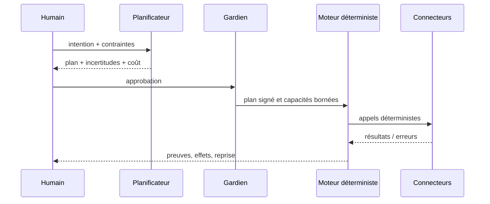

# Hanuman et les agents à cinq ans

> Archive non normative — revue stratégique de juillet 2026.

## Position

Un agent n’est pas une personnalité dans l’interface. C’est un décideur probabiliste limité à un rôle, des outils, un budget et une politique. Hanuman doit coordonner des agents, jamais leur abandonner sa gouvernance.

## Rôles envisageables

| Agent | Mission | Outils autorisés | Sortie par défaut |
|---|---|---|---|
| Planificateur | décomposer une intention en étapes | catalogue de capacités en lecture | plan non exécuté |
| Triage | classer mails/issues/notes | lecture + labels proposés | file de décisions |
| Synthèse | produire un briefing sourcé | lecture bornée | artefact avec provenance |
| Gardien | vérifier politiques, portée, doublons | journal + règles | autoriser/refuser/escalader |
| Réparateur | proposer une reprise après échec | état d’exécution | plan de compensation |
| Observateur | détecter anomalies de flux | métriques agrégées | alerte explicable |

Un « agent chef » omnipotent est une mauvaise idée : il concentre permissions, erreurs et contexte hostile.

## Communication

Les agents échangent des objets structurés versionnés, jamais des conversations libres comme seul contrat. Chaque message porte `run_id`, provenance, hypothèses, confiance, budget restant et capacités demandées.

## Coordination

- Le moteur déterministe possède l’état; aucun agent ne « se souvient » seul d’une exécution.
- Le gardien applique des politiques non modifiables par les agents.
- Une capacité d’écriture est accordée pour une cible et une durée, pas globalement.
- Toute boucle a un nombre maximal d’étapes, de tokens, d’appels et une échéance.
- Les contenus Gmail, Notion ou web sont des données non fiables, donc potentiellement des prompt injections.

## Garder l’humain au centre

Trois niveaux d’autonomie :

1. **Conseiller** : lit et propose.
2. **Supervisé** : prépare des changements groupés soumis à approbation.
3. **Délégué borné** : exécute une recette répétitive, réversible et plafonnée.

Le niveau 3 exige un historique de succès, un rayon d’impact faible et un bouton d’arrêt. Aucun agent ne peut s’auto-promouvoir.

## Risques

- Prompt injection par données connectées.
- Corrélation indue de données personnelles entre services.
- Automatisation de confiance (« puisque c’est fluide, c’est vrai »).
- Dérive de coût et boucles.
- Explications plausibles mais causalité fausse.
- Dépendance à un fournisseur de modèle.

## Décision

Les agents sont V4. Avant eux, Hanuman doit savoir exécuter et expliquer parfaitement un plan écrit par un humain. Ajouter un LLM au-dessus d’exécutions opaques amplifierait les défauts actuels.
