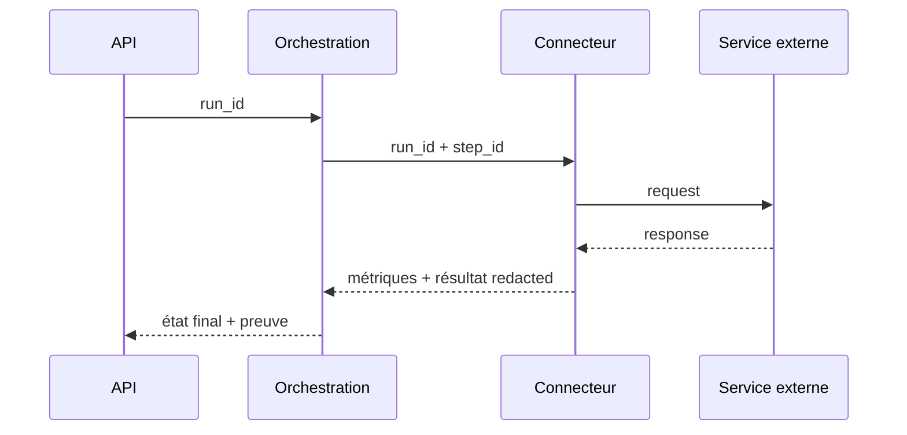

# Stratégie d’observabilité

> Archive non normative — revue stratégique de juillet 2026.

## État observé

Structlog produit console et fichiers JSON rotatifs par niveau. Un middleware journalise requête/réponse. Un décorateur ajoute source et durée. Un journal d’orchestration JSONL alimente le dashboard. Ces briques sont utiles mais ne forment pas encore une histoire causale unique.

## Modèle minimal d’exécution

Chaque run doit porter :

```text
run_id, orchestration, version, trigger, started_at, ended_at
state: planned|awaiting_approval|running|partial|succeeded|failed|cancelled
step_id, attempt, connector, capability
input_fingerprint, effect_count, no_op_count
duration_ms, external_calls, cost, error_code
```

Les contenus, tokens, corps de mail et chemins sensibles sont exclus ou hachés selon politique.

## Tracing



OpenTelemetry n’est pas requis immédiatement. Un identifiant propagé et des événements structurés cohérents produisent d’abord l’essentiel. Adopter une plateforme externe avant ce schéma ajouterait du coût sans améliorer les données.

## Health checks

Séparer :

- **liveness** : le processus répond;
- **readiness** : configuration locale valide;
- **connectivity** : fournisseur accessible;
- **authorization** : scope/token suffisant;
- **capability check** : opération minimale non destructive.

Un fournisseur indisponible ne doit pas rendre Hanuman « mort ».

## Métriques et alertes

- taux succès/partiel/échec par orchestration;
- âge du dernier succès;
- taux de no-op et doublons évités;
- erreurs auth/rate-limit/timeout;
- runs bloqués en attente ou actifs anormalement longtemps;
- volume d’écritures et coût IA.

Alertes uniquement sur action requise : token expiré, run bloqué, répétition d’échec, budget dépassé. Pas d’alerte sur chaque erreur transitoire.

## Runbooks prioritaires

1. Token expiré/révoqué.
2. Rate limit.
3. Écriture partielle Notion.
4. Fichier Obsidian déplacé ou conflit.
5. Processus d’orchestration disparu.

## Rétention

Logs techniques courts (7–14 jours), preuves d’exécution plus longues mais minimales, contenu personnel jamais dupliqué « pour debug ». L’utilisateur doit pouvoir purger l’historique sans toucher aux systèmes sources.
