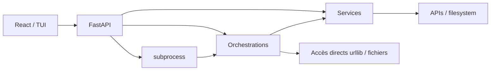

# Revue d’architecture

## Périmètre et niveau de preuve

Cette revue décrit le dépôt observé en juillet 2026. Elle distingue le code actif des intentions du README. Le code contient un point d’entrée principal `hanuman.main:app`, des routes sous `api/core` et `api/routers`, des services de plateforme, des orchestrations, un registre de connecteurs et trois interfaces (React, API, TUI). Les dossiers `services/adapters/*` sont présents mais vides : l’architecture « adapter » documentée est donc une intention, pas une réalité.

## Forces

- La séparation routes/services/orchestrations existe réellement et est compréhensible.
- Les services Notion, GitHub, Calendar, Wikipedia et Chess isolent une part significative des appels externes.
- Le registre de connecteurs exprime déjà des capacités plutôt que des écrans.
- Les modèles Pydantic, le typage strict, Ruff et une suite de tests substantielle donnent une bonne base.
- Obsidian reste un système de fichiers; Hanuman ne tente pas de l’absorber.
- Les orchestrations sont des modules indépendants, faciles à tester en isolation.

## Faiblesses et couplages

| Observation | Conséquence |
|---|---|
| Deux styles de routes (`api/core`, `api/routers`) | conventions d’erreur et de réponse divergentes |
| Deux approches Notion (service `requests` et orchestration `urllib`) | auth, erreurs et version d’API dupliquées |
| Configuration via `config.env`, `core.config`, `os.environ` et `load_dotenv(override=True)` | provenance et validation difficiles |
| Connecteurs déclaratifs sans interface d’exécution commune | catalogue utile, mais non contraignant |
| Orchestrations lançables par import, CLI et `subprocess.Popen` | cycle de vie, retour et annulation non unifiés |
| Logs techniques et journal JSONL séparés | pas d’identité d’exécution bout en bout |
| Valeurs personnelles codées dans Chess → Obsidian | portabilité faible, risque d’écriture au mauvais endroit |
| Routes qui retournent parfois une erreur métier en HTTP 200 | clients et monitoring ambigus |
| Code HTML historique dans une route et frontend React parallèle | deux surfaces à maintenir |

## Responsabilités réelles

La flèche `orchestrations → accès directs` est la principale entorse : elle contourne parfois les services. La flèche `API → services` est légitime pour les opérations simples, à condition que la route reste adaptatrice.

## Dépendances critiques

- APIs tierces et leurs versions : Notion est la plus sensible aux changements de schéma.
- OAuth Google : token lifecycle dupliqué entre Gmail et Calendar.
- Filesystem local : permissions, chemins absolus et atomicité.
- FastAPI/Starlette/httpx/anyio : la mission de stabilité a observé un blocage local de `TestClient`, y compris sur une application minimale.
- Formats implicites Notion/Markdown : le contrat existe dans le code plus que dans des modèles versionnés.

## Simplifications possibles, sans refonte

1. Définir d’abord une convention documentaire d’erreur et d’exécution; ne migrer le code qu’au fil des changements.
2. Nommer un « chemin canonique » par plateforme dans la documentation et marquer les doublons comme legacy.
3. Exiger une fiche de contrat pour chaque orchestration avant de créer un moteur générique.
4. Transformer le registre actuel en inventaire de référence avant d’imaginer un plugin system.
5. Déclarer `hanuman.main:app` comme seul point d’entrée public; documenter l’autre comme historique si confirmé.

## Risques futurs

- Une synchronisation bidirectionnelle sans modèle d’identité provoquerait doublons et écrasements.
- Ajouter des agents avant un journal d’exécution fiable rendrait les incidents inexplicables.
- Un système de plugins prématuré figerait de mauvaises abstractions.
- Une UI « constellation » connectée directement aux plateformes contournerait la gouvernance.
- L’exposition réseau du service, conçu selon un modèle local mono-utilisateur, changerait radicalement le modèle de menace.

## Décision recommandée

Ne pas réarchitecturer maintenant. Stabiliser un **contrat d’orchestration** sur deux flux réels (Obsidian → Notion et GitHub → Notion), puis laisser l’architecture émerger de leurs invariants communs. C’est moins séduisant qu’un moteur générique, mais beaucoup plus probant.
