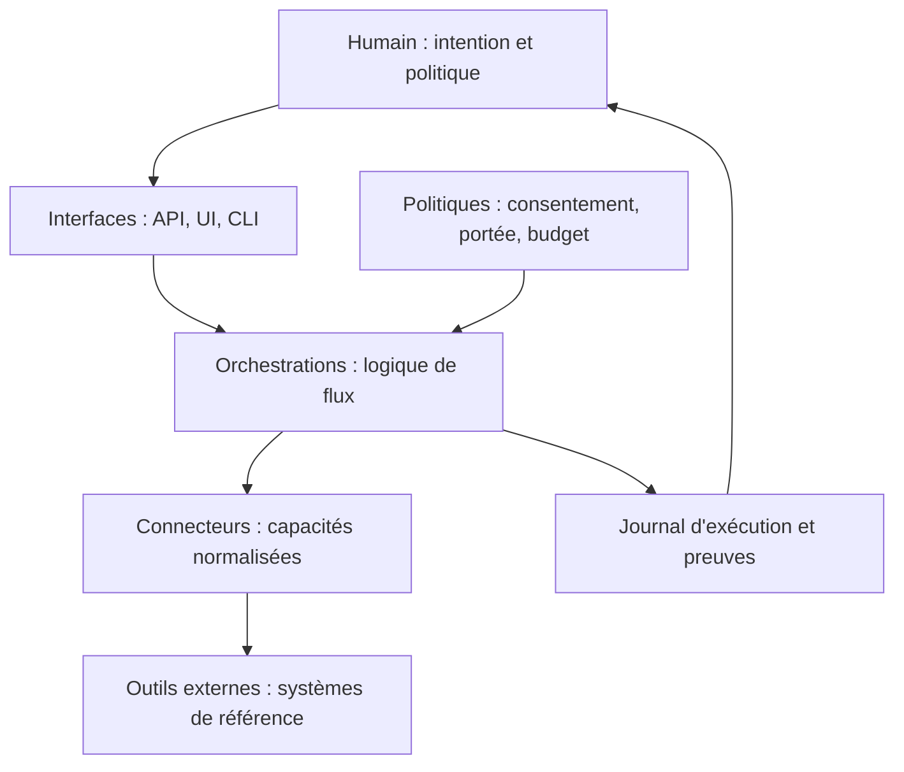

# Constitution de Hanuman

Statut : proposition fondatrice. Toute décision future devrait expliciter sa conformité à ce document.

## Vision

Hanuman est le plan de contrôle personnel qui relie les outils où le travail et la connaissance vivent déjà. Il permet à une personne de formuler une intention — « transformer ceci, relier cela, préparer ceci » — puis d’en confier l’exécution à un système observable, réversible et respectueux des sources.

La vision n’est pas « toutes les données dans Hanuman ». Elle est « toutes les capacités coordonnées par Hanuman ».

## Mission

Réduire le coût cognitif des passages entre outils sans confisquer à l’utilisateur le choix de ses outils, la propriété de ses données ni la décision finale.

## Philosophie et valeurs

1. **Orchestrer avant de stocker.** Une donnée reste dans son système de référence sauf nécessité démontrée.
2. **Intention avant mécanisme.** Une orchestration exprime un résultat métier; un connecteur exprime une capacité technique.
3. **Humain responsable.** Hanuman prépare, explique et propose; l’humain autorise les effets importants.
4. **Réversibilité.** Toute écriture doit avoir une prévisualisation, une identité, une trace et, si possible, une compensation.
5. **Vérité située.** Hanuman indique la source, la date, la transformation et le degré d’incertitude.
6. **Local d’abord, portable toujours.** Le mode personnel local est une force; il ne justifie ni formats opaques ni dépendance irréversible.
7. **Fiabilité avant magie.** Un flux simple, déterministe et auditable vaut mieux qu’un agent autonome impressionnant mais imprévisible.
8. **Moindre privilège et moindre mouvement.** Lire seulement ce qui est requis; envoyer seulement ce qui est nécessaire.

## Ce que Hanuman est

- Un catalogue de capacités offertes par des connecteurs.
- Un moteur d’orchestrations explicites entre ces capacités.
- Un poste d’observation des exécutions, erreurs, décisions et effets.
- Une interface d’intention et de consentement.
- À terme, un coordinateur d’agents spécialisés bornés par des politiques.

## Ce que Hanuman n’est pas

- Une alternative à Obsidian, Notion, Gmail, Calendar, GitHub ou Drive.
- Une base de connaissances universelle.
- Un clone de Zapier, n8n ou Make destiné à tous les cas d’entreprise.
- Un agent général autorisé à agir sans limites.
- Un moteur de recherche qui aspire toutes les données par défaut.
- Un réseau social, un gestionnaire de tâches ou un éditeur de notes.

Si un outil existant remplit mieux une fonction, Hanuman doit l’orchestrer. Il ne doit la reconstruire que si cette capacité est indispensable à la sûreté ou à l’explicabilité de l’orchestration.

## Architecture logique

Les routes adaptent HTTP. Les orchestrations coordonnent. Les services/connecteurs parlent aux plateformes. Les modèles portent les contrats. L’observabilité décrit ce qui s’est passé. Aucune couche ne doit absorber silencieusement la responsabilité d’une autre.

## Architecture humaine

| Rôle | Responsabilité | Ne délègue pas |
|---|---|---|
| Propriétaire | finalité, données, niveau d’autonomie | consentement à un effet important |
| Mainteneur | contrats, qualité, releases, incidents | validation des risques |
| Auteur de connecteur | fidélité à l’API externe, auth, quotas | politique métier |
| Auteur d’orchestration | résultat, idempotence, compensation | secrets et transport |
| Agent IA | proposition ou transformation bornée | définition de ses propres permissions |

Dans un projet personnel, une même personne peut tenir tous les rôles; les responsabilités restent distinctes.

## Règles immuables

1. Hanuman ne remplace pas les outils connectés.
2. Un connecteur ne contient pas de décision métier inter-outils.
3. Une orchestration ne manipule pas directement credentials ou protocole si un connecteur existe.
4. Aucune écriture distante importante sans prévisualisation ou consentement explicite.
5. Aucun secret dans logs, prompts, réponses API ou dépôt.
6. Toute exécution a une identité, un état final et une provenance.
7. Les erreurs partielles sont visibles; elles ne sont jamais maquillées en succès.
8. Les données sources ne sont jamais détruites pour « simplifier » une synchronisation.
9. L’IA ne devient jamais la source de vérité sur un fait externe.
10. Une nouvelle plateforme entre par un connecteur, pas par une exception architecturale.

## Définitions

### Connecteur

Une frontière technique vers un système. Il expose des capacités stables (`mail.read`, `knowledge.write`), gère authentification, pagination, quotas, timeouts et traduction d’erreurs. Il ne décide pas pourquoi ni quand appeler la plateforme.

### Orchestration

Un flux métier nommé qui combine des capacités pour produire un résultat. Elle définit préconditions, étapes, identité/idempotence, politique d’erreur, effets, preuve de résultat et reprise. Un script ponctuel sans contrat d’exécution n’est pas encore une orchestration.

### Agent IA

Un composant non déterministe chargé d’une décision ou transformation bornée. Il reçoit un contexte minimal, des outils autorisés, un budget et un critère d’arrêt. Ses sorties sont des propositions jusqu’à validation ou jusqu’à ce qu’une politique explicite autorise l’action.

## Principes d’orchestration

- Déclarer la source de vérité de chaque objet.
- Séparer lecture, transformation, décision et écriture.
- Préférer `plan → preview → apply → verify` aux appels opaques.
- Porter une clé d’idempotence et une corrélation de bout en bout.
- Définir la sémantique de reprise avant le parallélisme.
- Propager une erreur structurée avec contexte non sensible.
- Préserver le contenu original ou son empreinte.
- Rendre explicites les limites de fraîcheur et les conflits.

## Anti-patterns

- « Aspirer tout dans une base centrale » : coûteux, risqué, contraire à la souveraineté des outils.
- « Un grand agent avec tous les outils » : permissions excessives et causalité illisible.
- « Une route = une orchestration complète » : couplage transport/métier.
- « Synchronisation bidirectionnelle magique » : conflits et pertes sans modèle d’identité.
- « Catch-all puis `ok: false` en HTTP 200 » : observabilité et contrats ambigus.
- « Graphe pour faire joli » : visualiser sans permettre une décision n’apporte pas de valeur.
- « Plugin universel maintenant » : abstraction prématurée tant que trois connecteurs conformes ne valident pas le contrat.
- « Mémoire propriétaire » : recrée un outil que Hanuman promet de ne pas remplacer.

## Critères d’acceptation d’une fonctionnalité

Une fonctionnalité n’entre en roadmap que si toutes les réponses bloquantes sont satisfaites :

1. Quelle friction inter-outils mesurable supprime-t-elle ?
2. Pourquoi Hanuman est-il mieux placé qu’un outil existant ?
3. Quel système reste source de vérité ?
4. Quels effets produit-elle et comment sont-ils prévisualisés ?
5. Quel est son modèle d’identité, d’idempotence et de conflit ?
6. Quelles données et permissions minimales exige-t-elle ?
7. Comment teste-t-on sans service réel ?
8. Comment l’utilisateur comprend-il succès, échec partiel et reprise ?
9. Comment la désactiver sans perdre de données ?
10. Quel coût permanent d’exploitation crée-t-elle ?

Un « non » aux questions 2, 3, 4 ou 6 impose le rejet ou la reformulation.

