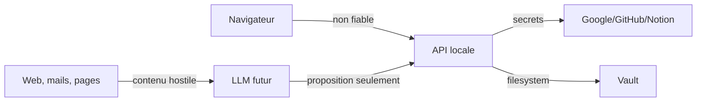

# Audit stratégique de sécurité

## Modèle actuel

Usage personnel local, mono-utilisateur, secrets locaux, APIs externes et données potentiellement intimes. Ce modèle réduit l’attaquant distant mais augmente l’importance des permissions locales, des erreurs d’orchestration et des contenus non fiables. Toute écoute réseau ou hébergement change le modèle et exige une nouvelle revue.

## Risques classés

### Critiques conditionnels

- **API exposée sans authentification.** Les routes peuvent lire des données, lancer des processus ou écrire vers Notion/Obsidian. Critique uniquement si accessible hors poste de confiance.
- **Prompt injection inter-outils.** Devient critique lorsqu’un agent peut agir sur des instructions trouvées dans un mail, une page ou le web.

### Élevés

- CORS permissif (`*`) avec credentials autorisés : configuration incohérente et dangereuse hors local.
- Lancement d’orchestrations par endpoint et `subprocess.Popen` sans politique d’autorisation ni limite.
- Tokens Calendar écrits par un gestionnaire générique sans permission restrictive explicite.
- Erreurs externes renvoyées parfois telles quelles, susceptibles de révéler contexte ou contenu.
- Chemins absolus acceptés pour Obsidian : utile localement, mais contourne la borne du vault selon le chemin d’appel.

### Modérés

- Multiples sources de secrets/configuration et chargement `.env` avec override.
- Scopes, rotation et révocation non inventoriés dans une surface unique.
- Logs JSON et journaux d’exécution pouvant contenir chemins, requêtes ou données personnelles.
- Absence visible de protection CSRF/state persisté pour certains parcours OAuth; Gmail utilise un state côté flux mais sa vérification mérite un test de contrat.
- Dépendances et images Docker non gouvernées par une politique de mise à jour documentée.
- CI alimentée par secrets réels alors que les tests devraient employer des valeurs factices.

### Faibles

- Informations personnelles et chemins absolus dans la documentation historique.
- Health checks pouvant révéler les services configurés.
- Réponses du dashboard contenant la commande de processus.

## Frontières de confiance

## Principes de contrôle

- Bind loopback par défaut et échec fermé si configuration d’exposition ambiguë.
- Capabilities et scopes minimaux; lecture séparée de l’écriture.
- Redaction structurée avant sérialisation des logs.
- Validation de cible après résolution canonique du chemin.
- Approbation proportionnelle au rayon d’impact.
- Secrets jamais transmis au modèle.
- Sauvegarde atomique et permissions `0600` pour tout token.

## Ce qui n’est pas recommandé

Ajouter immédiatement un système complexe d’identités ou un coffre-fort maison serait prématuré. Utiliser le keyring/secret manager du système, ou un outil existant, est préférable. Hanuman doit orchestrer les politiques de secrets, pas devenir un gestionnaire de secrets.
