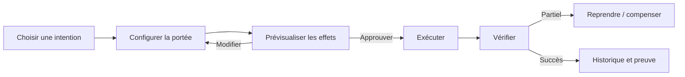
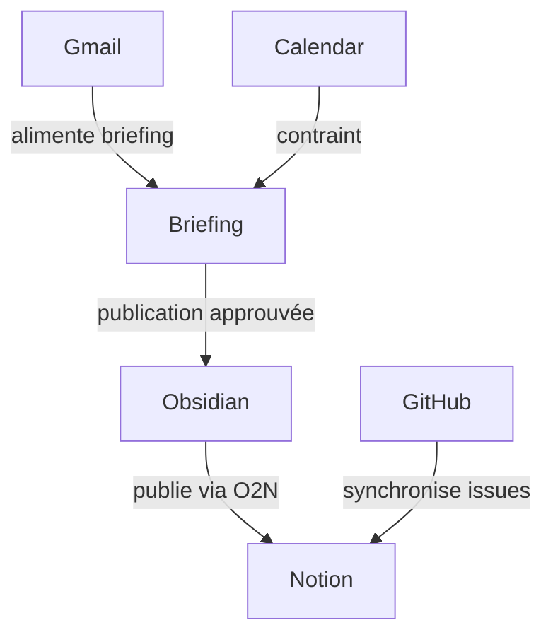

# Vision UX

## Principe directeur

L’interface ne doit pas montrer « tout Hanuman ». Elle doit rendre les intentions, effets et décisions compréhensibles. L’écran principal n’est ni un chat ni un dashboard de vanity metrics : c’est un cockpit d’orchestrations.

## Navigation

1. **Aujourd’hui** : exécutions actives, approbations, erreurs à reprendre.
2. **Orchestrations** : recettes disponibles, état, dernière exécution, portée.
3. **Connecteurs** : capacités, santé, permissions, dernière utilisation.
4. **Historique** : chronologie filtrable et preuves.
5. **Politiques** : règles d’approbation, budgets, cibles autorisées.

## Workflow cœur

La prévisualisation montre créations, mises à jour, éléments ignorés, permissions, coût estimé et irréversibilités. Un diff vaut mieux qu’un bouton « Sync ».

## Écrans

- **Inbox de décisions** : cartes groupées par risque, avec approbation unitaire ou lot homogène.
- **Détail d’exécution** : timeline des étapes, entrées résumées, appels externes redacted, sorties, durée, reprise.
- **Fiche orchestration** : but, sources de vérité, déclencheurs, effets, historique, version.
- **Fiche connecteur** : connecté/configuré/disponible distingués, scopes OAuth, quotas et capacités.
- **Constellation** : vue secondaire des relations entre outils, orchestrations et artefacts; chaque nœud mène à une action ou une preuve.

## Constellation utile

Le graphe ne doit pas indexer toute connaissance. Il visualise le **graphe opérationnel** :

Une arête porte statut, fraîcheur, dernière exécution et politique. Sans cela, la constellation est décorative et doit être rejetée.

## Interactions et raccourcis

- `⌘/Ctrl K` : lancer une intention, jamais rechercher arbitrairement toutes les données.
- `G A` : approbations; `G R` : runs; `G C` : connecteurs.
- `P` : preview; `A` : approuver; `X` : arrêter; `R` : reprendre.
- Toutes les actions destructrices exigent confirmation contextuelle, jamais une modale générique.

## Accessibilité et confiance

- Statut exprimé par texte et icône, pas seulement couleur.
- Horodatage absolu au survol des durées relatives.
- « Inconnu » plutôt qu’un faux vert.
- Détails progressifs : intention d’abord, JSON seulement en diagnostic.
- Aucune donnée sensible dans notifications système.

## Critique

Le frontend actuel prouve plusieurs domaines mais risque de devenir une collection de pages par connecteur. La bonne unité UX est l’intention inter-outils. Il ne faut toutefois pas refaire l’interface avant d’avoir le modèle d’exécution V1.
